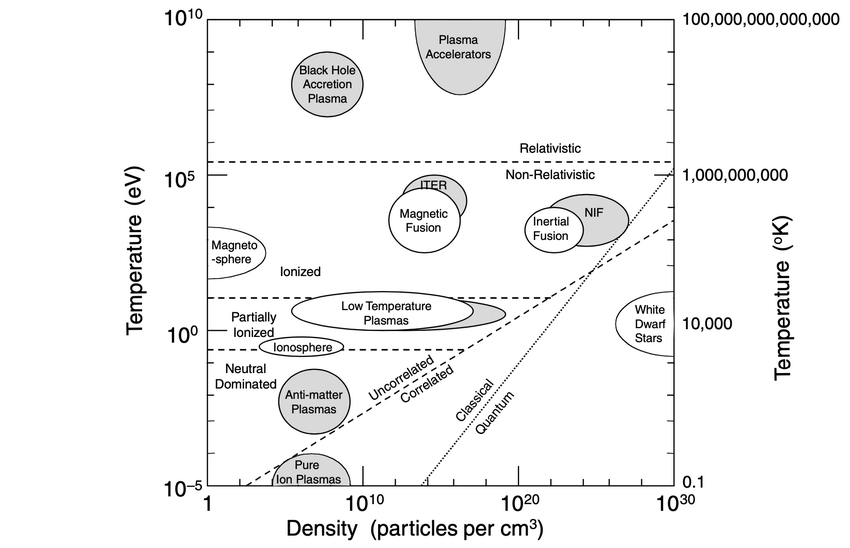

Plasma physics is one of the most important field in physics to study during the 21st century. Pushing the edge of knowledge in this field will drive more short term impact on our world than possibly any other field in physics. The distinguishing factor lies in plasma physics' applications relevant to pressing engineering challenges: solving the climate crisis and enabling human exploration of space. In other words, controlled thermonuclear fusion as a green grid energy source and space thrusters that could transport humans outside our solar system. And plasma physics is one hell of a fun form of physics to learn about and solve problems on, from applying fundamental electromagnetics to a fourth state of matter and looking through different lenses of plasma description to creating captivating computer simulations of plasma that could inform us on experimental predictions. Enough of the contextual motivation, let's get to some fun plasma physics questions I wanted to figure out the right answer to... which may hopefully motivate the reader even more.

> **Why isn't electric current like in a cable a plasma?**
> Fair question. Because we often think of plasma as streaming ions and electrons and, well, a current in the coaxial cable charging my laptop is also a inverted stream of positive ions and negative electrons. But let's step back - plasma *can* have an electric current but also *may not*. A mere current is a motion of charge which can happen in any conducting material. A plasma is a material (though tricky to call it a 'material' when it is in fact a fourth state of matter) which can be conducting (when the charged particles in the plasma have net directed motion), and the copper wire in my computer charger is a conducting material, in which electrons drift through a solid crystal lattice where the positive ions remain bound. 

> **How fast can plasma travel and how?**
> Plasmas are so special because they can travel at an enormous range of speeds. The key is that plasmas experience so many different physical processes including particle motion, fluid motion, pressure waves, and electromagnetic waves. So, there is a bulk flow speed (how fast the plasma moves as a whole), an electron thermal speed and ion thermal speed (random motion of electrons and ions due to temperature), a sound speed (speed of pressure disturbances through the plasma), an Alfvén speed (speed of magnetic disturbances through the plasma), and an electromagnetic wave speed (speeds potentially close to the speed of light $c$).

> **Does fusion require any other physics beyond plasma physics? Like quantum physics?**
> Absolutely. Plasma physics only accounts for one (but most critical) part of the fusion process - getting the nuclei together in a dense enough, hot enough, and stable enough plasma. Quantum mechanics comes into play right after because fusion at achievable temperatures relies on quantum tunneling through the Coulomb barrier. Classically (ie if not considering QM), most nuclei would not have enough energy to get close enough to fuse. And once the nuclei get close enough, it is nuclear physics that governs the strong nuclear force that fuses the nuclei and enables energy release from the reaction. Of course, fundamental physics like statistical mechanics, thermodynamics, electromagnetism, and fluid mechanics underpin all the above processes. Oh, and relativity is also relevant in correcting ordinary fusion plasmas, but matters more for some high-energy particles and radiation processes. 

> **What are the different kinds of plasma?**
> I think the best way to answer this question is to provide the following diagram. Laboratory plasmas to space plasmas and everything in between. Source: National Research Council, Plasma Science Committee, Plasma 2010 Committee, et al. *Plasma science: advancing knowledge in the national interest*, volume 3. National Academies Press, 2008.
>
> 
>
> Check out the associated [government report](https://acrobat.adobe.com/id/urn:aaid:sc:US:001deea4-4ddc-46a9-be01-d4a824c45860).

> **When did humans make the first plasma?**
> The earliest human made plasmas were probably electrical discharges in low pressure gases, though at first people didn't know they were partially creating the fourth state of matter. In 1705, Francis Hauksbee produced glowing electrical discharges in a partially evacuated glass bulb. Much later in 1857, Heinrich Geissler developed reliable gas discharge tubes where high voltage ionized low pressure gas and produced glowing plasma. However, it was William Crookes who recognized experimentally that ionized gas was something fundamentally different from ordinary gas by studying cathode rays generated in his own vacuum tubes. He called it "radiant matter," though it was Faraday who first coined that term in 1816:
>
> "If we conceive a change as far beyond vaporization as that is above fluidity, and then take into account also the proportional increased extent of alteration as the changes rise, we shall perhaps, if we can form any conception at all, not fall far short of radiant matter; and as in the last conversion many qualities were lost, so here also many more would disappear." - Michael Faraday
> 
> And I must quote William Crookes' writing on this radiant matter, plasma, in 1879. If only scientific papers were still written at such a level of sophistication and literary rhythm:
>
> "In studying this fourth state of matter we seem, at length, to have within our grasp and obedient to our control the little indivisible particles which, with good warrant, are supposed to constitute the physical basis of the universe. We have seen that, in some of its properties, radiant matter is as material as this table, while in other properties it almost assumes the character of radiant energy. We have actually touched the border-land where matter and force seem to merge into one another, the shadowy realm between known and unknown, which for me has always had peculiar temptations. I venture to think that the greatest scientific problems of the future will find their solution in this border-land, and even beyond ; here, it seems to me, lie ultimate realities, subtile, far-reaching, wonderful." - William Crookes

> **What do we not yet know about plasma theory? What are the cutting edge topics?** The interesting thing is that we often know the underlying equations, such as Maxwell's equations, kinetic equations, and fluid/MHD equations, but we still cannot predict what their nonlinear solutions will do in many realistic plasmas. One central problem is plasma turbulence and how we can't yet predict turbulent transport from first principles with the reliability that we'd like. In fusion plasmas, this is super important because turbulence often determines how quickly heat leaks out of the confinement region. Obviously there is a whole breadth of things we can't fully comprehend or predict in plasma and its behavior. Check out a [2021 report](https://www.nationalacademies.org/read/25802) by the US National Academy of Sciences, Engineering, and Medicine. Also check out a [2016 DOE report](https://science.osti.gov/-/media/fes/pdf/program-news/Frontiers_of_Plasma_Science_Final_Report.pdf) by the Panel on Frontiers of Plasma Science. 