$\to$ [I. Energy conservation](#i)

$\to$ [II. Cold plasma dielectric tensor](#ii)

$\to$ [III. CPDR R- and L-waves](#iii)

$\to$ [IV. CPDR conductivity tensor](#iv)

$\to$ [V. Ionosphere density](#v)

$\to$ [VI. Wave normal surface plots from CMA diagram](#vi)

$\to$ [VII. Whistler waves](#vii)

$\to$ [VIII. Faraday rotation density estimation](#viii)

$\to$ [IX. Microwave interferometry diagnostic](#ix)

$\to$ [X. Faraday rotation of ruby laser along plasma column](#x)

$\to$ [XI. Electrostatic dispersion relation](#xi)

$\to$ [XII. Electromagnetic waves with collisions](#xii)


## Summary of my solutions on this page


<div style="border: 1px solid #ccc; padding: 1rem; border-radius: 8px;">
Welcome to the basis chapter of plasma waves. 

We'll start with analyzing Poynting's equation i.e. the electromagnetic (EM) energy conservation equation. It balances the rate of change of EM energy stored in a region, the net flow of EM energy out of that region, and the power transferred from the fields to charged matter. 

We then dive into the simplest setup of a plasma - cold, no pressure gradient, no collisions, just perturbations in electric field and velocity. We start from scratch with Maxwell's equations in a medium and an equation of motion. This allows us to lead up to when we eventually work through full dispersion relation derivations. 

Skipping ahead to the full Cold Plasma Dispersion Relation (CPDR) derived in Swanson, we check out some of its componental waves - the fundamental R and L waves that propagate by definition parallel to the unperturbed magnetic field. We note their opposite polarizations. 

Through a quick exercise using our dielectric tensor in a cold plasma, we can attain a conductivity tensor. 

We also solve a fun application problem approximating electron density in the ionosphere given some things we know about the behavior of AM and FM radiowaves which act as ordinary waves from the CPDR. 

Breaking down the CPDR a little more, we plot a few wave normal surfaces in high-frequency regions of the CMA diagram and learn about the wave mode propagations in each of them. 

One cool result of the CPDR is whistler waves, which was discovered by accident during World War I while German radio monitors were trying to intercept radio transmission from the Allies. They didn't have a narrow radio bandwidth, so they detected seemingly random waves that acted like descending tones. These waves were later traced to lightning and propagation in the ionosphere and the magnetosphere thanks to plasma physics. Whistler waves can propagate for thousands of miles, following Earth's magnetic field lines and sometimes bounce between hemispheres multiple times. 

Another application of CPDR is Faraday rotation, a feature of magnetoactive media. Faraday rotation is essentially caused by a difference in R and L waves change in polarization, causing the whole E-field vector to rotate. We can use this phenomenon as a diagnostic to measure electron density or magnetic field of some plasma medium. 

Another diagnostic tool enabled by plasma waves for a cold plasma is microwave interferometry, in which we make use of the O-wave. By using a comparison between a wave traveling through a plasma and a reference wave which does not travel through the plasma, the phase difference can be used as a measure of the plasma density. We apply this diagnostic to a cylindrical plasma column with an axial magnetic field - one of the simplest plasma configurations - and also look at the wave normal surface of a ruby laser propagating along its magnetic field. 

We then go into an analysis of electrostatic waves in a cold plasma. These waves are longitudinal and we learn that to approximate them, the refractive index should be large compared to all of the dielectric tensor elements. 

Last, following the procedure to attain the CPDR, which doesn't originally account for collisions, we introduce a collision frequency between electrons and ions. As expected, this changes how our conductivity and dielectric tensors look like, but there's still definitely some symmetries in the mathematical structure for regular CPDR vs. disperion relation for electromagnetic waves subject to collisions. 
</div>


--------


# I.
#### Show that when $\omega$ is complex, with $\omega = \omega_r + i\omega_i$, eletromagnetic energy conservation averaged over an oscillation period can be written as,
$$
\oint \mathbf{P}\cdot d\mathbf{S} + \frac{\omega_i}{2}\int\left(\frac{|\hat{\mathbf{B}}|^2}{\mu_0} + \varepsilon_0 |\hat{\mathbf{E}}|^2\right)\ dV = -D
$$

where

$$
\mathbf{P}=\frac{1}{2\mu_0}\operatorname{Re}\left(\hat{\mathbf{E}}\times\hat{\mathbf{B}}^*\right)
$$

and

$$
D=\frac{1}{2}\operatorname{Re}\int\left(\hat{\mathbf{E}}\cdot\hat{\mathbf{J}}^*\right)\ dV
$$

--------

Our real physical fields are as such:

$$\mathbf{E}(\mathbf{r},t)=\operatorname{Re}[\hat{\mathbf{E}}(\mathbf{r})e^{-i\omega t}]$$
$$\mathbf{B}(\mathbf{r},t)=\operatorname{Re}[\hat{\mathbf{B}}(\mathbf{r})e^{-i\omega t}]$$
$$\mathbf{J}(\mathbf{r},t)=\operatorname{Re}[\hat{\mathbf{J}}(\mathbf{r})e^{-i\omega t}]$$

Poynting's theorem:

$$
\oint \mathbf{P}\cdot d\mathbf{A} = -\frac{\partial W}{\partial t} - D
$$

where

$$
\mathbf{P}=\frac{1}{2\mu_0}\left(\mathbf{E}\times\\mathbf{B}\right)
$$

and

$$
D=\int\left(\mathbf{E}\cdot\mathbf{J}\right)\ dV
$$

and

$$
W=\int \left(\frac{1}{2} \varepsilon_0|\mathbf{E}|^2 + \frac{1}{2\mu_0}|\mathbf{B}|^2 \right)dV = \int (u) dV
$$

Averaging over an oscillating period looks like $\langle f \rangle =\frac{1}{T} \int_0^T f(t)dt $ where $T=\frac{2\pi}{\omega_r}$ (note real part of $\omega$), so we have:

$$
\oint \langle \mathbf{P} \rangle \cdot d\mathbf{A} + \frac{d}{dt} \int \langle u \rangle dV = - \int \langle \mathbf{E}  \cdot \mathbf{J} \rangle dV
$$

When $\omega_i \neq 0$, then $\langle u \rangle$ is not constant in time, so $\frac{d}{dt}$ term stays. From the question, we're not dealing with a complex $\omega=\omega_r + i\omega_i$. Setting operators we let: 
$$
[\mathbf{A}][\mathbf{B}]=\operatorname{Re}[\hat{\mathbf{A}}e^{-i\omega t}][\hat{\mathbf{B}}e^{-i\omega t}]
$$

$$
= \frac{1}{2}[\hat{\mathbf{A}}e^{-i\omega t} + \hat{\mathbf{A}}^* e^{-i\omega t}]\frac{1}{2}[\hat{\mathbf{B}}e^{-i\omega t} + \hat{\mathbf{B}}^* e^{-i\omega t}]
$$

$$
= \frac{1}{4}[\hat{\mathbf{A}}\hat{\mathbf{B}}e^{-2i\omega t} + \hat{\mathbf{A}}\hat{\mathbf{B}}^*e^{-i\omega t}e^{i\omega^\* t} + \hat{\mathbf{A}}^\*\hat{\mathbf{B}}e^{-i\omega t}e^{i\omega^\* t} + \hat{\mathbf{A}}^\*\hat{\mathbf{B}}^\*e^{-2i\omega^\* t}]
$$

$$
= \frac{1}{2}\operatorname{Re}[\hat{\mathbf{A}}\hat{\mathbf{B}}e^{-2i\omega t}] + \frac{1}{2}\operatorname{Re}[\hat{\mathbf{A}}\hat{\mathbf{B}}^\*e^{-i\omega t}e^{i\omega^\* t}]
$$

From $ e^{-i\omega t}e^{i\omega^\* t}=e^{-i(\omega - \omega^\*)t} = e^{-i(\omega_r+i\omega_i-\omega_r+i\omega_i)t} = e^{2\omega_i t}$:

$$
[\mathbf{A}][\mathbf{B}] = \frac{1}{2} \operatorname{Re}[\hat{\mathbf{A}}\hat{\mathbf{B}}e^{-2i\omega t}] + \frac{1}{2}\operatorname{Re}[\hat{\mathbf{A}}\hat{\mathbf{B}}^\*e^{2\omega_i t}]
$$

We begin applying this to the Poynting vector averaged over an oscillation period $\langle \mathbf{P} \rangle$:

$$
\langle \mathbf{P} \rangle = \langle \frac{1}{\mu_0}(\mathbf{E} \times \mathbf{B}) \rangle = \langle \frac{1}{2\mu_0} \operatorname{Re}[(\hat{\mathbf{E}} \times \hat{\mathbf{B}})e^{-2i\omega t}] + \frac{1}{2\mu_0} \operatorname{Re}[(\hat{\mathbf{E}} \times \hat{\mathbf{B}}^*)e^{2\omega_i t}] \rangle
$$

$$
= \langle \frac{1}{2\mu_0} \operatorname{Re}[(\hat{\mathbf{E}} \times \hat{\mathbf{B}})e^{-2i\omega_r t}e^{2\omega_i t}] \rangle + \langle \frac{1}{2\mu_0}e^{2\omega_i t} \operatorname{Re} [(\hat{\mathbf{E}} \times \hat{\mathbf{B}}^*)] \rangle
$$

From left term:

$$
\langle e^{-2i\omega_r t} \rangle = \frac{1}{T} \int_0^T e^{-2i\omega_r t} dt = \frac{1}{T} \int_0^T \cos(2\omega_r t) - i\sin (2\omega_r t) dt = 0
$$


Because there is no oscillating factor at $\omega_r$ (cause $T=2\pi / \omega_r$) from the right term, we can simplify to:

$$
\langle \mathbf{P} \rangle = \frac{1}{2\mu_0} \operatorname{Re} [(\hat{\mathbf{E}} \times \hat{\mathbf{B}}^*)]e^{2\omega_i t}
$$

Let's do the similar sort of thing for electric field + magnetic field energy density averaged over an oscillation period $\langle u \rangle$:

$$
\langle u \rangle = \langle \frac{1}{2}\varepsilon_0 |\mathbf{E}|^2 + \frac{1}{2\mu_0}|\mathbf{B}|^2 \rangle = \langle \frac{1}{4}\varepsilon_0 \operatorname{Re} [\hat{\mathbf{E}} \cdot \hat{\mathbf{E}}e^{-2i\omega t}] \rangle + \langle \frac{1}{4}\varepsilon_0 \operatorname{Re} [\hat{\mathbf{E}} \cdot \hat{\mathbf{E}}^*e^{2\omega_i t}] \rangle + \langle \frac{1}{4\mu_0} \operatorname{Re} [\hat{\mathbf{B}} \cdot \hat{\mathbf{B}}e^{-2i\omega t}] \rangle + \langle \frac{1}{4\mu_0} \operatorname{Re} [\hat{\mathbf{B}} \cdot \hat{\mathbf{B}}^*e^{2\omega_i t}] \rangle 
$$

$$
= \langle \frac{1}{4}\varepsilon_0 \operatorname{Re} [\hat{\mathbf{E}} \cdot \hat{\mathbf{E}}e^{-2i\omega t}] \rangle + \langle \frac{1}{4}\varepsilon_0 e^{2\omega_i t} \operatorname{Re} [|\hat{\mathbf{E}}|^2] \rangle + \langle \frac{1}{4\mu_0} \operatorname{Re} [\hat{\mathbf{B}} \cdot \hat{\mathbf{B}}e^{-2i\omega t}] \rangle + \langle \frac{1}{4\mu_0} e^{2\omega_i t} \operatorname{Re} [|\hat{\mathbf{B}}|^2] \rangle 
$$

$ \hat{\mathbf{E}} \cdot \hat{\mathbf{E}} $ and $ \hat{\mathbf{B}} \cdot \hat{\mathbf{B}} $ are $ =0 $:

$$
\langle u \rangle = \frac{1}{4}\varepsilon_0 e^{2\omega_i t} |\hat{\mathbf{E}}|^2 + \frac{1}{4\mu_0} e^{2\omega_i t} |\hat{\mathbf{B}}|^2
$$

Aaaaand for power transferred to charges per unit volume averaged over an oscillation period $ \langle \mathbf{E} \cdot \mathbf{J} \rangle $:

$$
\langle \mathbf{E} \cdot \mathbf{J} \rangle = \langle \frac{1}{2} \operatorname{Re}[\hat{\mathbf{E}} \cdot \hat{\mathbf{J}}e^{-2i\omega t}] \rangle + \langle \frac{1}{2} \operatorname{Re}[\hat{\mathbf{E}} \cdot \hat{\mathbf{J}}^*e^{2\omega_i t}] \rangle 
$$

$\hat{\mathbf{E}} \cdot \hat{\mathbf{J}}$ is $0$:

$$
\langle \mathbf{E} \cdot \mathbf{J} \rangle=\frac{1}{2} \operatorname{Re}[\hat{\mathbf{E}} \cdot \hat{\mathbf{J}}^*]e^{2\omega_i t}
$$

We may now return to full Poynting's theorem averaged over one period of oscillation:

$$
\oint \langle \mathbf{P} \rangle \cdot d\mathbf{A} + \frac{d}{dt} \int \langle u \rangle dV = - \int \langle \mathbf{E}  \cdot \mathbf{J} \rangle dV
$$

where

$$
\frac{d}{dt} \langle u \rangle = \frac{d}{dt}(\frac{1}{4} \varepsilon_0 e^{2\omega_i t} |\hat{\mathbf{E}}|^2) + \frac{d}{dt}(\frac{1}{4\mu_0} e^{2\omega_i t} |\hat{\mathbf{B}}|^2) 
$$

$$
= \frac{\omega_i}{2} \varepsilon_0 |\hat{\mathbf{E}}|^2 e^{2\omega_i t} + \frac{\omega_i}{2\mu_0} |\hat{\mathbf{B}}|^2 e^{2\omega_i t}
$$

So Poynting's theorem becomes:

$$
\oint \frac{1}{2\mu_0} \operatorname{Re}[\hat{\mathbf{E}} \times \hat{\mathbf{B}}^*] e^{2\omega_i t} \cdot d\mathbf{A} + \int \left(\frac{\omega_i}{2} \varepsilon_0 |\hat{\mathbf{E}}|^2 e^{2\omega_i t} + \frac{\omega_i}{2\mu_0} |\hat{\mathbf{B}}|^2 e^{2\omega_i t} \right) dV = - \int \frac{1}{2} \operatorname{Re}[\hat{\mathbf{E}} \cdot \hat{\mathbf{J}}^\*]e^{2\omega_i t} dV
$$

$$
\therefore \frac{1}{2\mu_0} \oint \operatorname{Re}[\hat{\mathbf{E}} \times \hat{\mathbf{B}}^*] \cdot d\mathbf{A} + \frac{\omega_i}{2}\int \left(\varepsilon_0 |\hat{\mathbf{E}}|^2  + \frac{1}{\mu_0} |\hat{\mathbf{B}}|^2 \right) dV = - \frac{1}{2}\int \operatorname{Re}[\hat{\mathbf{E}} \cdot \hat{\mathbf{J}}^\*] dV
$$

nice


-----------
# II. 
#### Derive the form of the cold plasma dielectric tensor, $\mathbf{K}$ (shown in Eq. 2.10 in Swanson Plasma Waves)

--------

From Maxwell's equations:

$$
\mathbf{J} - i\omega \varepsilon_0 \mathbf{E} = -i\omega \varepsilon_0 \mathbf{K} \cdot \mathbf{E}
$$

Equation of motion:

$$
m_j \frac{d\mathbf{v_j}}{dt} = q_j(\mathbf{E} + \mathbf{v_j} \times \mathbf{B})
$$

Linearizing (given $\mathbf{B_0} = B_0 \mathbf{\hat{z}}$):

$$
m_j \frac{d\mathbf{v_{j1}}}{dt} =  q_j(\mathbf{E_1}+\mathbf{v_{j1}} \times \mathbf{B_0})
$$

Fourier analysis:

$$
-i\omega m_j \mathbf{v_{j1}} = q_j(\mathbf{E_1} + \mathbf{v_{j1}} \times \mathbf{B_0})
$$

Let's check out the components of $\mathbf{v_{j1}}$:

- x-component:
$$
-i\omega m_j v_{xj} = q_j(E_x + B_0 v_{yj})
$$
- y-component:
$$
-i\omega m_j v_{yj} = q_j(E_y - B_0 v_{xj})
$$
- z-component:
$$
-i\omega m_j v_{zj} = q_j E_z
$$

Nice we can substitute for plasma frequency after some algebraic shifting... $\epsilon_j \omega_{cj} = \frac{q_j B_0}{m_j}$:

- perpendicular components
$$
-i\omega v_{xj} = \frac{q_j}{m_j} E_x + \epsilon_j \omega_{cj} v_{yj} \to -i\omega v_{xj} - \epsilon_j \omega_{cj} v_{yj} = \frac{q_j}{m_j} E_x
$$

$$
-i\omega v_{yj} = \frac{q_j}{m_j} E_y + \epsilon_j \omega_{cj} v_{xj} \to -i\omega v_{yj} - \epsilon_j \omega_{cj} v_{xj} = \frac{q_j}{m_j} E_y
$$

- parallel component
$$
-i\omega v_{zj} = \frac{q_j}{m_j} E_z \to v_{zj} = i\frac{q_j}{m_j \omega} E_z
$$

Rewriting perpendicular components in matrix form cause we wanna solve for $v_{xj}$ and $v_{yj}$:

$$
\begin{pmatrix}
-i\omega & -\epsilon_j \omega_{cj} \\\\
\epsilon_j \omega_{cj} & -i\omega
\end{pmatrix} 
\begin{pmatrix}v_{xj} \\\\ v_{yj} \end{pmatrix} = \frac{q_j}{m_j} \begin{pmatrix} E_x \\\\ E_y \end{pmatrix} 
$$

Using $\operatorname{det} \to (i\omega)^2 - (\epsilon_j \omega_{cj})(-\epsilon_j \omega_{cj})=\omega_{cj}^2 - \omega^2$ we can acquire matrix inverse:

$$
\begin{pmatrix} v_{xj} \\\\ v_{yj} \end{pmatrix} = \frac{q_j}{m_j} \frac{1}{\omega_{cj}^2 - \omega^2} \begin{pmatrix} -i\omega & \epsilon_j \omega_{cj} \\\\
-\epsilon_j \omega_{cj} & -i\omega \end{pmatrix} \begin{pmatrix} E_x \\\\ E_y \end{pmatrix}
$$

Now we expand matrix for its x- and y-components:

$$
v_{xj} = \frac{q_j}{m_j} \frac{1}{\omega_{cj}^2 - \omega^2} (-i\omega E_x + \epsilon_j \omega_{cj} E_y) = \frac{q_j}{m_j} \frac{1}{\omega^2 - \omega_{cj}^2}(i\omega E_x - \epsilon_j \omega_{cj} E_y)
$$

$$
v_{yj} = \frac{q_j}{m_j} \frac{1}{\omega_{cj}^2 - \omega^2}(-\epsilon_j \omega_{cj} E_x - i\omega E_y) = \frac{q_j}{m_j} \frac{1}{\omega^2 - \omega_{cj}^2}(\epsilon_j \omega_{cj} E_x + i\omega E_y)
$$

Let's rewrite all components of $v_j$ in current density using $\mathbf{J} = \sum_{j} n_{0j} q_j \mathbf{v_j}$:

$$
j_x = \sum_j n_{0j} \frac{q_j^2}{m_j}  \frac{1}{\omega^2 - \omega_{cj}^2}(i\omega E_x - \epsilon_j \omega_{cj} E_y)
$$

$$
j_y = \sum_j n_{0j} \frac{q_j^2}{m_j}  \frac{1}{\omega^2 - \omega_{cj}^2}(\epsilon_j \omega_{cj} E_x + i\omega E_y)
$$

$$
j_z = i \sum_j n_{0j} \frac{q_j^2}{m_j} \frac{1}{\omega} E_z
$$

Oh hey, note plasma frequency $\omega_{pj}^2=\frac{n_{0j}q_j^2}{\varepsilon_0 m_j} \to n_{0j}\frac{q_j^2}{m_j}=\varepsilon_0 \omega_{pj}^2$ ... let's substitute:

$$
j_x= \varepsilon_0 \sum_j \frac{\omega_{pj}^2}{\omega^2 - \omega_{cj}^2}(i\omega E_x - \epsilon_j \omega_{cj} E_y)
$$

$$
j_y = \varepsilon_0 \sum_j \frac{\omega_{pj}^2}{\omega^2 - \omega_{cj}^2}(\epsilon_j \omega_{cj} E_x + i\omega E_y)
$$

$$
j_z = i \varepsilon_0 \sum_j \frac{\omega_{pj}^2}{\omega} E_z
$$

Ampère-Maxwell along with the first equation we wrote for this problem:

$$
\nabla \times \mathbf{B} = \mu_0 \mathbf{J} + \mu_0 \varepsilon_0 \frac{\partial \mathbf{E}}{\partial t} = \mu_0 \mathbf{J} - i\omega \mu_0 \varepsilon_0 \mathbf{E}
$$

$$
\mathbf{J} - i\omega \varepsilon_0 \mathbf{E} = -i\omega \varepsilon_0 \mathbf{K} \cdot \mathbf{E}
$$

So...

$$
\mathbf{K} \cdot \mathbf{E} = \frac{i}{\varepsilon_0 \omega} \mathbf{J} + \mathbf{E} \mathbf{I}
$$

Using this ($\mathbf{I}$ is identity matrix) we can acquire the dielectric tensor $\mathbf{K}$ in the form:

$$
\mathbf{K} = \begin{pmatrix} K_{xx} & K_{xy} & 0 \\\\ K_{yx} & K_{yy} & 0 \\\\ 0 & 0 & K_{zz} \end{pmatrix}
$$

Starting with $K_{xx}$ (for this one, no $E_y$ term because we look at parts proportional to $E_x$ in $j_x$...similar thing applies to all other components of $\mathbf{K}$) then moving on:

$$
K_{xx} E_x = \frac{i}{\varepsilon_0 \omega}\left(\varepsilon_0 \sum_j \frac{\omega_{pj}^2}{\omega^2 - \omega_{cj}^2}(i\omega E_x)\right) + E_x = -\sum_j \frac{\omega_{pj}^2}{\omega^2 - \omega_{cj}^2} E_x + E_x
$$

$$
\therefore K_{xx} = 1-\sum_j \frac{\omega_{pj}^2}{\omega^2 - \omega_{cj}^2}
$$

$$
K_{yy} E_y = \frac{i}{\varepsilon_0 \omega}\left(\varepsilon_0 \sum_j \frac{\omega_{pj}^2}{\omega^2 - \omega_{cj}^2}(i\omega E_y)\right) + E_y = -\sum_j \frac{\omega_{pj}^2}{\omega^2 - \omega_{cj}^2} E_y + E_y
$$

$$
\therefore K_{yy} = 1-\sum_j \frac{\omega_{pj}^2}{\omega^2 - \omega_{cj}^2} = K_{xx}
$$

$$
K_{xy} E_y = \frac{i}{\varepsilon_0 \omega}\left(\varepsilon_0 \sum_j \frac{\omega_{pj}^2}{\omega^2 - \omega_{cj}^2}(- \epsilon_j \omega_{cj} E_y) \right)
$$ 

$$
\therefore K_{xy} = -i \sum_j \frac{\epsilon_j \omega_{cj} \omega_{pj}^2}{\omega(\omega^2 - \omega_{cj}^2)}
$$

$$
K_{yx} E_x = \frac{i}{\varepsilon_0 \omega}\left(\varepsilon_0 \sum_j \frac{\omega_{pj}^2}{\omega^2 - \omega_{cj}^2}(\epsilon_j \omega_{cj} E_x) \right)
$$ 

$$
\therefore K_{yx} = i \sum_j \frac{\epsilon_j \omega_{cj} \omega_{pj}^2}{\omega(\omega^2 - \omega_{cj}^2)} = -K_{xy}
$$

$$
K_{zz}E_z = \frac{i}{\varepsilon_0 \omega} \left(i \varepsilon_0 \sum_j \frac{\omega_{pj}^2}{\omega} E_z \right)+E_z
$$

$$
\therefore K_{zz} = 1-\sum_j \frac{\omega_{pj}^2}{\omega^2}
$$

Aaaaand behold dielectric tensor leading up to cold plasma dispersion relation:

$$
\therefore \mathbf{K} = \begin{pmatrix} 1-\sum_j \frac{\omega_{pj}^2}{\omega^2 - \omega_{cj}^2} & -i \sum_j \frac{\epsilon_j \omega_{cj} \omega_{pj}^2}{\omega(\omega^2 - \omega_{cj}^2)} & 0 \\\\ i \sum_j \frac{\epsilon_j \omega_{cj} \omega_{pj}^2}{\omega(\omega^2 - \omega_{cj}^2)} & 1-\sum_j \frac{\omega_{pj}^2}{\omega^2 - \omega_{cj}^2} & 0 \\\\ 0 & 0 & 1-\sum_j \frac{\omega_{pj}^2}{\omega^2} \end{pmatrix}
$$

nice

-------
# III.
#### Use the Cold Plasma Dispersion Relation (CPDR) to derive the following:

$$
\frac{i E_x}{E_y} = \frac{n^2-S}{D}
$$

#### Using this equation, show the path that the electric field vector makes in the $E_y$ vs. $E_x$ plane for the R wave. Repeat for the L wave. 

-------

CPDR:
$$
\begin{pmatrix} S-n^2\cos^2\theta & -iD & n^2\cos \theta \sin \theta \\\\ iD & S-n^2 & 0 \\\\ n^2 \cos \theta \sin \theta & 0 & P-n^2\sin^2 \theta \end{pmatrix} \begin{pmatrix} E_x \\\\ E_y \\\\ E_z \end{pmatrix}=0
$$

Check out second row:

$$
iDE_x+(S-n^2)E_y=0
$$

$$
iDE_x=(n^2-S)E_y
$$

$$
\therefore \frac{i E_x}{E_y} = \frac{n^2-S}{D}
$$

The R-wave dispersion relation is $n_R^2=R$:
$$
\frac{i E_x}{E_y} = \frac{R-S}{D}
$$

$$
R=S+D \to \frac{i E_x}{E_y} = \frac{D}{D}
$$

$$
\therefore E_x = -iE_y
$$

*$E_x$ and $E_y$ have equal magnitude and are $90$ degrees out of phase*.

Let's figure out how to plot.... let $\hat{E_y}=E_0$ so $\hat{E_x}=-iE_0$:

$$
E_y(t)=\operatorname{Re}[\hat{E_y}e^{-i\omega t}]=\operatorname{Re}[\hat{E_0}e^{-i\omega t}] = \operatorname{Re}[E_0(\cos \omega t - i \sin \omega t)] = E_0 \cos (\omega t)
$$

$$
E_x(t)=\operatorname{Re}[\hat{E_x}e^{-i\omega t}]=\operatorname{Re}[-i \hat{E_0}e^{-i\omega t}] = \operatorname{Re}[-iE_0(\cos \omega t - i \sin \omega t)] = -E_0 \sin (\omega t)
$$

```python
import numpy as np
import matplotlib.pyplot as plt
from mpl_toolkits.mplot3d import Axes3D

t = np.linspace(0, 2*np.pi, 2000)
Ex = -np.sin(t)
Ey =  np.cos(t)

fig = plt.figure(constrained_layout=True)
ax = fig.add_subplot(111, projection='3d')

ax.plot(t, Ex, Ey, linewidth=2, label='(t, Ex, Ey)')
ax.plot(t, Ex, 0*t, '--', linewidth=1.8, label='projection: (t, Ex, 0)')
ax.plot(t, 0*t, Ey, '--', linewidth=1.8, label='projection: (t, 0, Ey)')

ax.set_xlabel('t')
ax.set_ylabel('E_x(t) = -sin(t)')
ax.set_zlabel('E_y(t) = cos(t)')

ax.set_title('R-wave')
ax.legend()
plt.show()

```

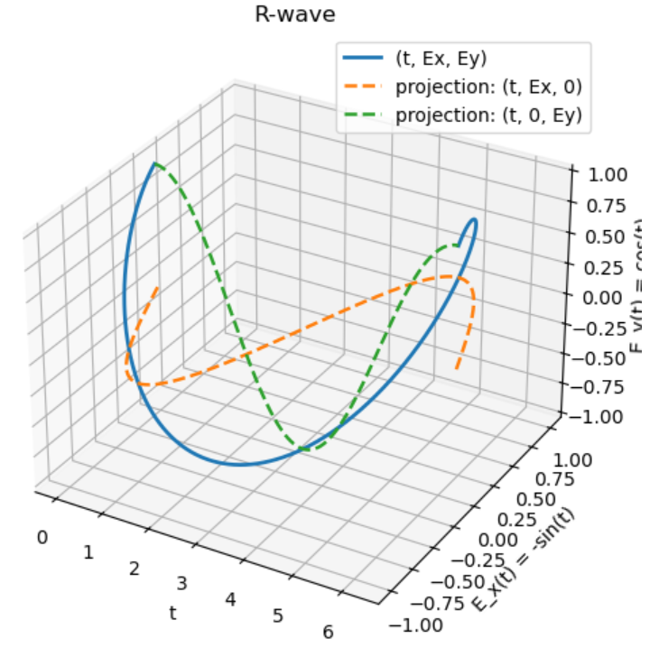

nice

The L-wave dispersion relation is $n_L^2=L$:

$$
\frac{iE_x}{E_y}=\frac{L-S}{D}=\frac{S-D-S}{D}=-1
$$

$$
\therefore E_x=iE_y
$$

*Again 90 degree phase shift but in the opposite sense*.

Again we let $\hat{E_y}=E_0$ so now $\hat{E_x}=iE_0$: 

$$
E_y(t)=\operatorname{Re}[E_0 e^{-i\omega t}] = \operatorname{Re}[E_0(\cos \omega t - i \sin \omega t)] = E_0 \cos (\omega t)
$$

$$
E_x(t)=\operatorname{Re}[{iE_0e^{-i\omega t}}]=\operatorname{Re}[iE_0(\cos \omega t - i \sin \omega t)] = E_0 \sin (\omega t)
$$

So this is the only fundamental change to the Python code:

```python
Ex = np.sin(t)
Ey =  np.cos(t)
```
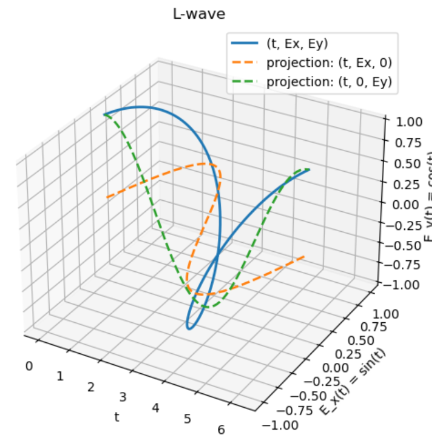

nice

-------
# IV.
#### For the Cold Plasma Dispersion Relation (CPDR), derive the elements of the conductivity tensor, $\mathbf{\sigma}$, where $\mathbf{J}=\mathbf{\overleftrightarrow{\sigma}} \cdot \mathbf{E}$.
----------

$$
\mathbf{J}-i\omega \varepsilon_0 \mathbf{E} = -i\omega \varepsilon_0 \mathbf{K} \cdot \mathbf{E}
$$

$$
\mathbf{J} = -i\omega \varepsilon_0 \mathbf{K} \cdot \mathbf{E} + i\omega \varepsilon_0 \mathbf{E}
$$

$$
\mathbf{J} = i\omega \varepsilon_0 (\mathbf{I} - \mathbf{K}) \cdot \mathbf{E}
$$

Since $\mathbf{J}=\mathbf{\overleftrightarrow{\sigma}} \cdot \mathbf{E}$:

$$
\mathbf{\overleftrightarrow{\sigma}} = i\omega \varepsilon_0 (\mathbf{I} - \mathbf{K})
$$

$$
\mathbf{\overleftrightarrow{\sigma}} = i\omega \varepsilon_0 \left[\begin{pmatrix} 1 & 0 & 0 \\\\ 0&1&0\\\\0&0&1 \end{pmatrix} - \begin{pmatrix} S&-iD&0\\\\iD&S&0\\\\0&0&P \end{pmatrix}\right]
$$

$$
\therefore \mathbf{\overleftrightarrow{\sigma}} =\begin{pmatrix} i\omega \varepsilon_0(1-S) & -\omega \varepsilon_0D&0 \\\\ \omega \varepsilon_0D&i\omega \varepsilon_0(1-S)&0 \\\\ 0&0&i\omega \varepsilon_0(1-P) \end{pmatrix}
$$

nice that was chill

-------
# V.
#### Since AM broadcast waves reflect from the ionosphere, permitting long range communication, whereas FM waves propagate through the ionosphere, limiting the range to line-of-sight, estimate the electron density in the ionosphere.

------

These purely AM/FM waves are electromagnetic waves described by the ordinary wave dispersion relation:

$$
n_O^2=P=1-\frac{\omega_{pe}^2}{\omega^2}-\frac{\omega_{pi}^2}{\omega^2}=1-\frac{\omega_p^2}{\omega^2}
$$

If $n^2 > 0$, then the wave propagates through the plasma. If $n^2 < 0$, the wave reflects. The condition for reflection is then:
$$
1-\frac{\omega_p^2}{\omega^2}<0 \to \omega_p> \omega 
$$

Thus we have a turning point at $\omega_p=\omega$:

$$
\omega = \sqrt{w_{pe}^2 + w_{pi}^2}
$$

$$
\omega^2 = w_{pe}^2 + w_{pi}^2
$$

From plasma frequency $w_{pj}^2=\frac{n_jq_j^2}{m_j\varepsilon_0}$ and given $n_e=n_i=n$ (this is electron and ion density $n$ not refractive index $n$...silly plasma physicists):

$$
\omega^2 = \frac{ne^2}{m_e\varepsilon_0} + \frac{ne^2}{m_i\varepsilon_0} = \frac{ne^2}{\varepsilon_0}\left(\frac{1}{m_e}+\frac{1}{m_i}\right)
$$

$$
n=\frac{\varepsilon_0 \omega^2}{e^2 (\frac{1}{m_e}+\frac{1}{m_i})}
$$

AM waves frequency ~ 1000 kHz ($\omega_{AM}=2\pi \cdot 10^6$) and FM waves frequency ~ 100 MHz ($\omega_{FM}=2\pi \cdot 10^8$). So we can bound the ionosphere electron density using both of these approximations of the reflective and propagating waves:

$$
\frac{\varepsilon_0 \omega_{AM}^2}{e^2 (\frac{1}{m_e}+\frac{1}{m_i})} < n_e < \frac{\varepsilon_0 \omega_{FM}^2}{e^2 (\frac{1}{m_e}+\frac{1}{m_i})}
$$

$$
\frac{(8.85\cdot10^{-12})(2\pi \cdot 10^6)^2}{(1.6\cdot10^{-19})^2(\frac{1}{9.11\cdot 10^{-31}}+\frac{1}{1.67\cdot 10^{-27}})} < n_e < \frac{(8.85\cdot10^{-12})(2\pi \cdot 10^8)^2}{(1.6\cdot10^{-19})^2(\frac{1}{9.11\cdot 10^{-31}}+\frac{1}{1.67\cdot 10^{-27}})}
$$

$$
\therefore 1.24 \cdot 10^{10} \operatorname{m^{-3}} \lesssim n_e \lesssim 1.24 \cdot 10^{14} \operatorname{m^{-3}}
$$

nice, pretty rough approximation of ionosphere electron density


-------
# VI
#### Create a computer program to plot the wave normal surfaces for $\mu=1833$, $Y=0.1$, and $X=0.75$. Create additional plots for $X=0.85$, $X=0.95$, $X=1.05$, and $X=1.15$. Discuss these plots and their relation to the CMA diagram. 
-------

$$
\mu = \frac{m_i}{m_e}
$$

$$
X=\frac{\omega_{pe}^2}{\omega^2}
$$

$$
Y=\frac{\omega_{ce}}{\omega}
$$

*CMA diagram:*


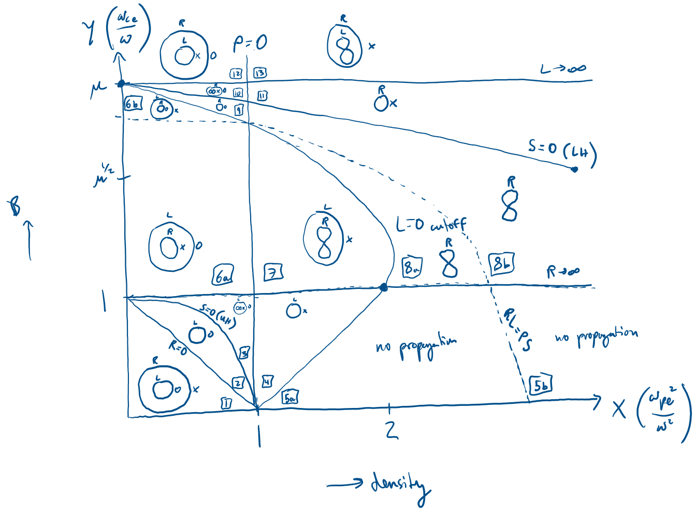

Let's write the different terms of the CPDR in terms of X and Y:

$$
R=1-\frac{\omega_{pi}^2}{\omega(\omega+\omega_{ci})}-\frac{\omega_{pe}^2}{\omega(\omega-\omega_{ce})}
$$

$$
=1-\frac{\omega_{pi}^2 / \omega^2}{1+\omega_{ci} /\omega} - \frac{\omega_{pe}^2 / \omega^2}{1-\omega_{ce} / \omega}
$$

$$
=1-\frac{\omega_{pe}^2 / \mu \omega^2}{1+\omega_{ce}/\mu \omega} - \frac{X}{1-Y}
$$

$$
=1-\frac{X/\mu}{1+Y/\mu} +\frac{X}{Y-1}
$$

$$
=1-\frac{X}{Y+\mu}+\frac{X}{Y-1}
$$

$$
L=1-\frac{\omega_{pi}^2}{\omega(\omega-\omega_{ci})} -\frac{\omega_{pe}^2}{\omega(\omega+\omega_{ce})}
$$

$$
=1-\frac{\omega_{pe}^2 / \mu \omega^2}{1-\omega_{ce}/ \mu \omega} - \frac{\omega_{pe}^2 / \omega^2}{1+\omega_{ce}/\omega} - 
$$

$$
=1-\frac{X/\mu}{1-Y/\mu}-\frac{X}{1+Y}
$$

$$
=1+\frac{X}{Y-\mu}-\frac{X}{Y+1}
$$

$$
P=1-\frac{\omega_{pe}^2}{\omega^2}-\frac{\omega_{pi}^2}{\omega^2}
$$

$$
=1-X-\frac{X}{\mu}
$$

$$
S=\frac{R+L}{2}
$$

$$
D=\frac{R-L}{2}
$$

CPDR:

$$
An^4-Bn^2+C=0
$$

where

$$
A=S\sin^2\theta + P\cos^2\theta
$$

$$
B=RL\sin^2\theta+PS(1+\cos^2\theta)
$$

$$
C=PRL
$$

$$
n^2(\theta)=\frac{B \pm \sqrt{B^2 -4AC}}{2A}
$$

We will be plotting wave normal surface with $u=1/n$ vs. $\theta$ (polar graph) with two branches:

$$
u(\theta)=\frac{1}{\sqrt{n^2\theta}} \to u_{\pm}(\theta)=\frac{1}{\sqrt{n_{\pm}^2(\theta)}}
$$

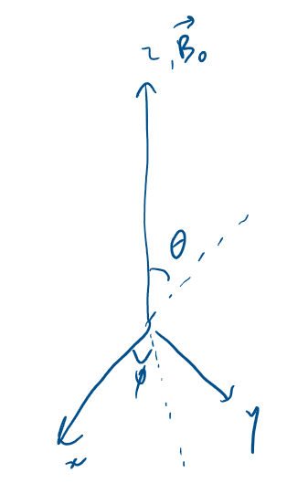

$$
u_{\parallel}(\theta)=u(\theta)\cos \theta
$$

$$
u_{\perp}(\theta)=u(\theta)\sin \theta
$$

$$
u_x=u_{\perp}(\theta)\cos \phi
$$

$$
u_y=u_{\perp}(\theta) \sin \phi
$$

$$
u_z=u_{\parallel}(\theta)
$$

We plot $u_x$, $u_y$, $u_z$ for a 3D graph then we plot $u_{\parallel}$ vs. $u_{\perp}$ for a 2D graph:

```python
import numpy as np
import matplotlib.pyplot as plt
from mpl_toolkits.mplot3d import Axes3D

def stix_params_with_ions(X, Y, mu=1833.0):
    """
    stix parameters R, L, P, S, D for a cold magnetized plasma 
    X = omega_pe^2 / omega^2
    Y = Omega_ce / omega  
    """

    # R, L, P 
    R = 1.0 - (X / (Y + mu)) + (X / (Y - 1))
    L = 1.0 + (X / (Y - mu)) - (X / (Y + 1))
    P = 1.0 - (X / mu) - X

    S = 0.5 * (R + L)
    D = 0.5 * (R - L)
    return R, L, P, S, D

def n2_plus_minus(theta, R, L, P, S):
    """
    solve the cold-plasma EM dispersion for n^2 as a function of theta
    returns n2_plus, n2_minus from:
    A n^4 - B n^2 + C = 0  -> n^2 = (B ± sqrt(B^2 - 4AC)) / (2A)
    """
    sin2 = np.sin(theta)**2
    cos2 = np.cos(theta)**2

    A = (S * sin2) + (P * cos2)
    B = (R * L * sin2) + (P * S * (1.0 + cos2))
    C = P * R * L

    disc = B**2 - (4.0 * A * C)

    # treat tiny negative from rounding as invalid
    disc = np.where(disc >= 0.0, disc, np.nan)
    sqrt_disc = np.sqrt(disc)

    n2_plus  = (B + sqrt_disc) / (2.0 * A)
    n2_minus = (B - sqrt_disc) / (2.0 * A)
    return n2_plus, n2_minus

def make_u_surface(u, theta, phi):
    """
    Given u(theta) and an azimuth grid phi, generate (ux, uy, uz) arrays
    for the surface of revolution around B0 (z-axis)
    """
    u2d  = u[:, None]         # (Ntheta, 1)
    th2d = theta[:, None]     # (Ntheta, 1)
    ph2d = phi[None, :]       # (1, Nphi)

    u_perp = u2d * np.sin(th2d)
    u_par  = u2d * np.cos(th2d)

    ux = u_perp * np.cos(ph2d)
    uy = u_perp * np.sin(ph2d)
    uz = u_par
    return ux, uy, uz


# Given CMA point
X = 0.75
Y = 0.1
mu = 1833.0

R, L, P, S, D = stix_params_with_ions(X, Y, mu=mu)

# theta grid (avoid endpoints)
Ntheta = 500
theta = np.linspace(1e-6, np.pi - 1e-6, Ntheta) # from 0 to pi

# Solve for n^2(theta)
n2_plus, n2_minus = n2_plus_minus(theta, R, L, P, S)

# Convert to u = 1/n, keeping only propagating parts where n^2 > 0
n_plus = np.where(n2_plus > 0.0, np.sqrt(n2_plus), np.nan)
n_minus = np.where(n2_minus > 0.0, np.sqrt(n2_minus), np.nan)

u_plus = 1.0 / n_plus
u_minus = 1.0 / n_minus

# azimuth for revolution
Nphi = 240
phi = np.linspace(0, 2*np.pi, Nphi)

# build surfaces
ux1, uy1, uz1 = make_u_surface(u_plus, theta, phi)
ux2, uy2, uz2 = make_u_surface(u_minus, theta, phi)

# plot
fig = plt.figure(figsize=(10, 8))
ax = fig.add_subplot(111, projection="3d")

ax.plot_surface(ux1, uy1, uz1, linewidth=0, alpha=0.55, antialiased=True)
ax.plot_surface(ux2, uy2, uz2, linewidth=0, alpha=0.55, antialiased=True)

ax.set_title(f"Wave normal (u) surfaces: u = ω/(ck) = 1/n\nX={X}, Y={Y}, mi/me={mu}")
ax.set_xlabel(r"$u_x$")
ax.set_ylabel(r"$u_y$")
ax.set_zlabel(r"$u_\parallel$")

# equal-ish scaling
max_range = np.nanmax([
    np.nanmax(np.abs(ux1)), np.nanmax(np.abs(uy1)), np.nanmax(np.abs(uz1)),
    np.nanmax(np.abs(ux2)), np.nanmax(np.abs(uy2)), np.nanmax(np.abs(uz2)),
])
ax.set_xlim(-max_range, max_range)
ax.set_ylim(-max_range, max_range)
ax.set_zlim(-max_range, max_range)

plt.tight_layout()
plt.show()
```

```python
# 2D plot: u_parallel vs u_perp 
u_perp_plus  = u_plus  * np.sin(theta)
u_par_plus   = u_plus  * np.cos(theta)

u_perp_minus = u_minus * np.sin(theta)
u_par_minus  = u_minus * np.cos(theta)

plt.figure(figsize=(7, 6))
plt.plot(u_perp_plus,  u_par_plus, color="k")
plt.plot(u_perp_minus, u_par_minus, color="k")
plt.plot(-u_perp_plus,  u_par_plus, color="k")
plt.plot(-u_perp_minus, u_par_minus, color="k")


plt.axhline(0, linewidth=1, color="gray")
plt.axvline(0, linewidth=1, color="gray")
plt.gca().set_aspect("equal", adjustable="box")
plt.xlabel(r"$u_\perp$")
plt.ylabel(r"$u_\parallel$")
plt.title(r"$u_\parallel$ vs $u_\perp$" + f" for wave normal surfaces: \nX={X}, Y={Y}, mi/me={mu}")
plt.tight_layout()
plt.show()
```

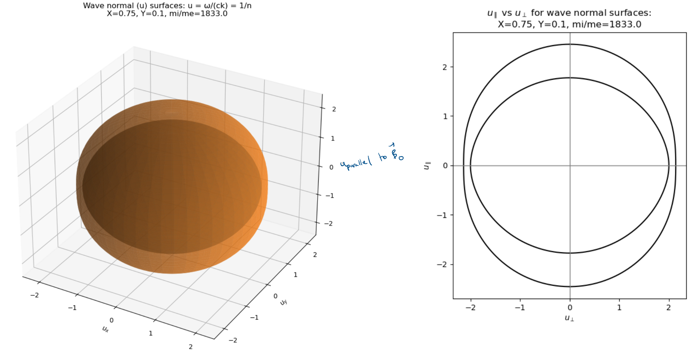

Here, we are in CMA region I, so we have two closed spheroidal surfaces where the outer, faster branch connects R and X modes (because smaller $n$, larger $u$) and the inner, slower branch connect L and O modes (because larger $n$, smaller $u$). 

```python
# Given CMA point
X = 0.85
Y = 0.1
mu = 1833.0
```

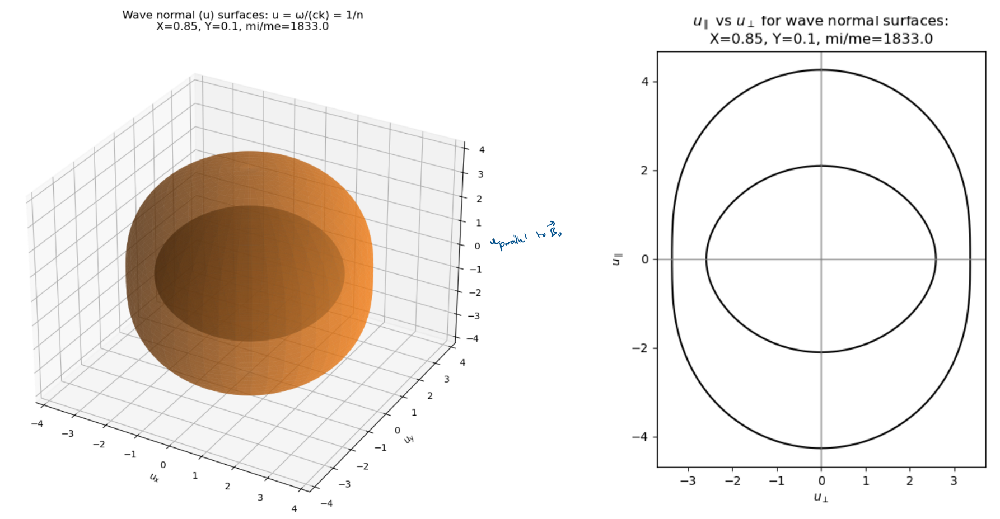

Here, we are approaching R=0 or X=0 cutoff but still in region I. So they are becoming more fast ($u\to 0$, $u \to \infty$), where the branch with R and X (outer branch) inflates strongly in $u$ while the inner branch with L and O contracts. 

```python
# Given CMA point
X = 0.95
Y = 0.1
mu = 1833.0
```

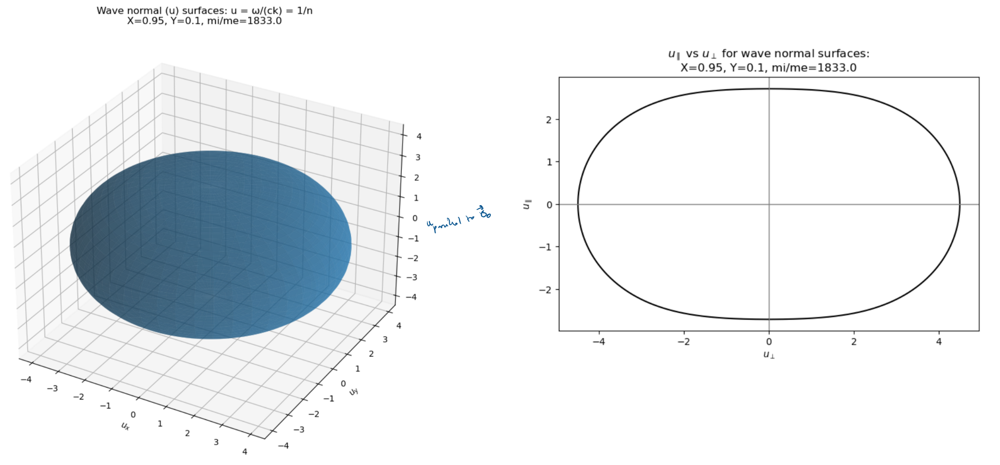

We are now in CMA region II, so the outer R and X waves disappear as we are past their cutoff. Thus, we just have the L and O waves. 

```python
# Given CMA point
X = 1.05
Y = 0.1
mu = 1833.0
```

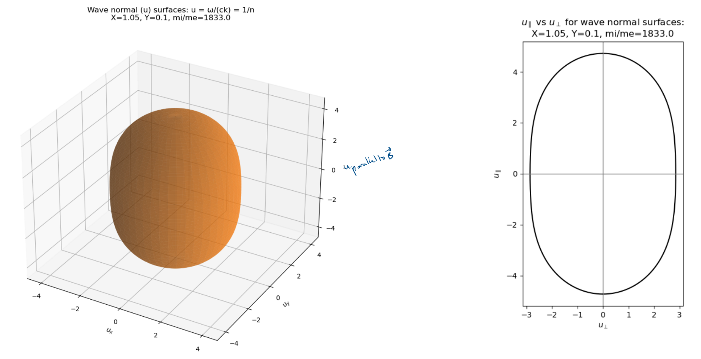

We are now in region IV. This is after recovering the X wave through S=0 upper hybrid resonance, then losing the O wave from the P=0 cutoff. Thus, we are left with the L and X waves. 

```python
# Given CMA point
X = 1.15
Y = 0.1
mu = 1833.0
```

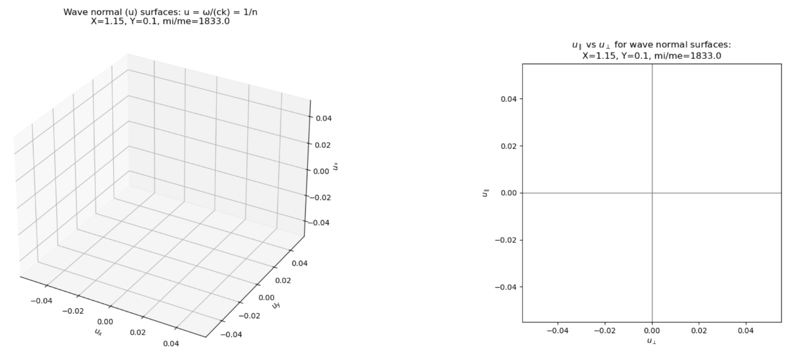

We are now in region 5a following the L=0 cutoff making both L and X waves disappear. So, we have no propagation. 

nice, thanks for following along on the many iterations of wave normal surfaces

-----
# VII
#### Consider whistler waves. From the whistler wave dispersion relation, derive the cone angle around $\mathbf{B_0}$ in which whistler wave energy flows $(\theta+\alpha)_{max}$. Then find the group velocity magnitude $|v_g|$ of the whistler wave. Sketch the wave normal surface lemniscoid for phase velocity. and the corresponding polar plot of $\mathbf{v_g}(\theta + \alpha)$. Due to the properties of the whistler wave, these approximate expressions are not valid as $\theta \to \pi /2$. What happens in this limit?

-----

Whistler wave dispersion relation:

$$
\omega = \frac{k^2c^2\omega_{ce}\cos\theta}{\omega_{pe}^2}
$$

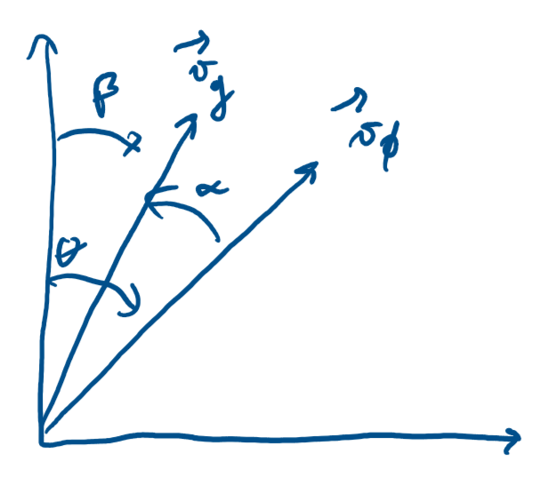

$$
\mathbf{v_g}=\nabla_k \omega = \frac{\partial \omega}{\partial k} \big|_{\theta} \mathbf{\hat{k}} + \frac{1}{k} \frac{\partial \omega}{\partial \theta} \big|_k \mathbf{\hat{\theta}}
$$

$$
\tan \alpha = \frac{\theta - \operatorname{component}}{k-\operatorname{component}}= \frac{\frac{1}{k} \frac{\partial \omega}{\partial \theta}\big|_k}{\frac{\partial \omega}{\partial k}} = \frac{-\frac{1}{k}\frac{k^2 c^2 \omega_c \sin \theta }{\omega_p^2}}{\frac{2kc^2\omega_c \cos \theta}{\omega_p^2}} = -\frac{1}{2}\frac{\sin \theta}{\cos \theta} = -\frac{1}{2} \tan \theta
$$


Using a trig identity for $\tan(a+b)$:

$$
\tan(\beta)=\tan(\theta + \alpha) = \frac{\tan \theta + \tan \alpha}{1-\tan \theta \tan \alpha}
$$

$$
\tan \alpha = -\frac{1}{2} \tan \theta
$$

$$
\tan(\theta + \alpha) = \frac{\tan \theta - \frac{1}{2}\tan \theta}{1-\tan \theta (-\frac{1}{2} \tan \theta)} = \frac{\frac{1}{2}\tan \theta}{1+\frac{1}{2}\tan^2\theta}
$$

$$
\tan(\theta + \alpha) = \frac{\tan \theta}{2+\tan^2 \theta}
$$

Maximizing $\tan(\theta + \alpha)$:

$$
\frac{d}{d\theta}(\tan(\theta + \alpha)) = 0 = \frac{d}{d\theta}\left(\frac{\tan \theta}{2+\tan^2\theta}\right)
$$

$$
0=\frac{(2+\tan^2 \theta)\sec^2\theta -\tan\theta(2\tan\theta \sec^2\theta)}{(2+\tan^2\theta)^2}
$$

$$
(2+\tan^2 \theta)\sec^2\theta -2\tan^2\theta \sec^2\theta = 0
$$

$$
2+\tan^2\theta - 2\tan^2\theta = 0 
$$

$$
\tan^2\theta =2 \to \tan\theta=\sqrt{2}
$$

$$
\tan(\theta + \alpha)_{max} = \frac{\tan\theta}{2+\tan^2\theta}= \frac{\sqrt{2}}{2+2} = \frac{\sqrt{2}}{4}
$$

$$
(\theta+\alpha)_{max} = \tan^{-1}\left(\frac{\sqrt{2}}{4}\right)
$$

$$
\therefore (\theta+\alpha)_{max} \approx 19.5^{\circ} 
$$

nice

Now let's find the group velocity magnitude of the whistler wave.

$$
\mathbf{v_g}= \frac{\partial \omega}{\partial k} \big|_{\theta} \mathbf{\hat{k}} + \frac{1}{k} \frac{\partial \omega}{\partial \theta} \big|_k \mathbf{\hat{\theta}}
$$

$$
|\mathbf{v_g}|=\sqrt{\left(\frac{\partial \omega}{\partial k} \big|_{\theta} \right)^2 + \left(\frac{1}{k} \frac{\partial \omega}{\partial \theta} \big|_k \right)^2}
$$

$$
=\sqrt{\left(\frac{2kc^2\omega_{ce}\cos \theta}{\omega_{pe}^2} \right)^2 + \left(-\frac{kc^2\omega_{ce}\sin \theta}{\omega_{pe}^2} \right)^2}
$$

$$
=\sqrt{\frac{4k^2c^4\omega_{ce}^2}{\omega_{pe}^4}\cos^2 \theta + \frac{k^2c^4\omega_{ce}^2}{\omega_{pe}^4}\sin^2\theta}
$$

$$
=\sqrt{\frac{k^2c^4\omega_{ce}^2}{\omega_{pe}^4}(4\cos^2 \theta +\sin^2\theta)}
$$

$$
\sin^2\theta=1-\cos^2\theta
$$

$$
\therefore |\mathbf{v_g}|=\frac{kc^2\omega_{ce}}{\omega_{pe}^2}\sqrt{1+3\cos^2\theta}
$$

nice

Let's look at the wave normal surface lemniscoid for the whistler wave's phase velocity:

$$
\mathbf{v_{\phi}} = \frac{\omega}{k} = \frac{k c^2\omega_{ce}\cos\theta}{\omega_{pe}^2} = c\sqrt{\frac{\omega \omega_{ce} \cos \theta}{\omega_{pe}^2}}
$$

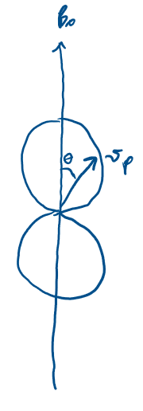

For whistler wave, group velocity is twice the speed of phase velocity:

$$
\mathbf{v_{g}}=  2c\sqrt{\frac{\omega \omega_{ce} \cos \theta}{\omega_{pe}^2}}
$$

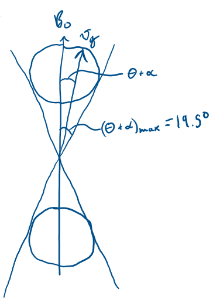

nice

As $\theta$ approaches $\pi / 2$, the phase and group velocities go to zero because of the cosine term in each of those expressions. The whistler wave is generally constrained to parallel propagation. The bottom line is that these phase and group velocity expressions are not accurate for angles near $\pi / 2$ as they were derive specifically excluding $\pi / 2$. 


------
# VIII
#### Consider Faraday rotation. Estimate the electron density required to produce 1 radian of Faraday rotation for a wave passing through the Crab nebula if the path length is estimated to be $L=3\cdot 10^{19}$ m, the magnetic field is assumed to be $B=10^{-9}$ T, and the observation is made with a $\lambda=21$ cm radiation. 
------

The rate of rotation of the E-field vector defining Faraday rotation (due to polarization rates of R and L vectors being different):

$$
\frac{d\phi}{dz}=\frac{\omega_{pe}^2 \omega_{ce}}{2\omega^2c}
$$

Total rotation angle then given by:

$$
\phi = \int_0^L \frac{\omega_{pe}^2 \omega_{ce}}{2\omega^2 c} dz
$$

Given $\omega=\frac{2\pi c}{\lambda}$, $\omega_{pe}^2=\frac{n_e e^2}{\varepsilon_0 m_e}$, $\omega_{ce}=\frac{e B_0}{m_e}$:

$$
\phi = \int_0^L \frac{\frac{n_e e^2}{\varepsilon_0 m_e} \frac{e B_0}{m_e}}{2 (\frac{2\pi c}{\lambda})^2 c} dz = \int_0^L \frac{n_e e^3 B_0 \lambda^2}{8 \pi^2 \varepsilon_0 m_e^2 c^3} dz = \frac{n_e e^3 B_0 \lambda^2 L}{8 \pi^2 \varepsilon_0 m_e^2 c^3}
$$

$$
n_e = \frac{8\pi^2 \varepsilon_0 m_e^2 c^3 \phi}{e^3 B_0 \lambda^2 L} = \frac{8\pi^2(8.85\cdot 10^{-12})(9.109\cdot10^{-31})^2 (3 \cdot 10^8)^3 (1)}{(1.602\cdot10^{-19})^3 (10^{-9})(0.21)^2(3\cdot 10^{19})}
$$

$$
\therefore n_e \approx 2878 \operatorname{m}^{-3}
$$

nice

--------
# IX
#### Consider a 10 cm diameter x 50 cm long plasma with a uniform axial magnetic field. We want to use microwave interferometry to measure our plasma density. We anticipate a peak density on the order of $10^{18} \operatorname{m}^{-3}$. What would be a good frequency to use? Draw a diagram and describe how the diagnostic works. Should we measure across the diameter or length of the plasma and why?

-------

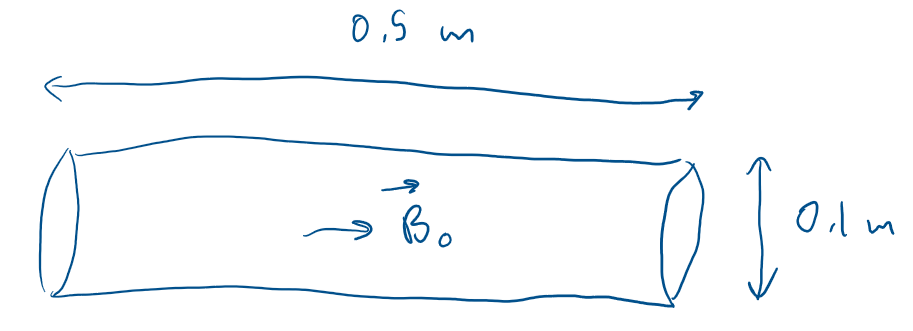

When optical or far infrared waves are employed, the wave frequency is much greater than the maximum plasma frequency. The frequency must be far enough above the maximum plasma frequency that refractive effects do not distort the path along the chord.

$$
\omega_{pe} = \sqrt{\frac{n e^2}{\varepsilon_0 m_e}}
$$

$$
\omega_{pe, max} = \sqrt{\frac{(10^{18})(1.602 \cdot 10^{-19})^2}{(8.85\cdot10^{-12})(9.109\cdot10^{-31})}} \approx 5.64 \cdot 10^{10} \frac{\operatorname{rad}}{\operatorname{s}}
$$

$$
f_{pe, max} = \frac{\omega_{pe, max}}{2\pi} \approx 8.98 \cdot 10^9 \operatorname{Hz} \approx \operatorname{GHz}
$$

We want $f \gg 8.98 \operatorname{GHz}$. From Wikipedia:

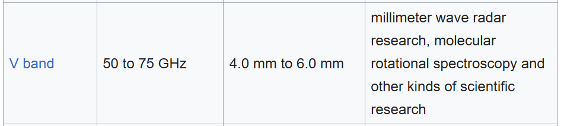

So we can use V-band microwave, around 60 GHz or $2\pi \cdot 60 \cdot 10^9$ rad/sec. 

For a cylindrical plasma column, the difference between phase with plasma and phase with no plasma for an O-wave: 

$$
\Delta \phi = -\frac{\bar{\omega_p^2} L}{2\omega c}
$$

If we measured across diameter:
$$
\Delta \phi \approx -\frac{(5.64\cdot10^{10})^2(0.1)}{2(2\pi \cdot 60 \cdot 10^9)(3 \cdot 10^8)} \approx -1.41 \operatorname{rad} \approx -0.45\pi \operatorname{rad}
$$

This phase difference is easily measurable. 

If we measured across length:

$$
\Delta \phi \approx -\frac{(5.64\cdot10^{10})^2(0.5)}{2(2\pi \cdot 60 \cdot 10^9)(3 \cdot 10^8)} \approx -7.03 \operatorname{rad} \approx -2.24\pi  \operatorname{rad}
$$

This is also measurable, but more likely to have phase wrapping and stronger sensitivity to any axial nonuniformity. 

Sketch of microwave ($f \approx 60 \operatorname{MHz}$) diagnostic:

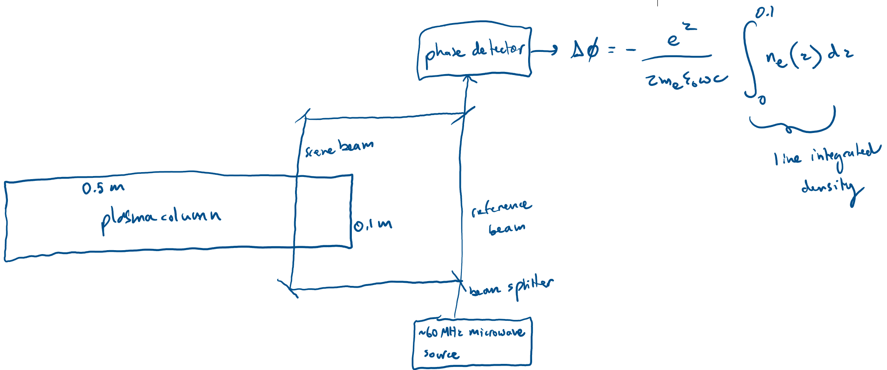

We measured across the diameter because microwave interferometry directly measures the line-integrated density along the beam path, and a transverse chord through a cylindrical plasma gives a well-defined column length tied to the radial profile. By taking phase-shift measurements along a transverse chord, or even multiple transverse chords if desired (not depicted in the sketch), the radial density profile along with peak density can be recovered using a mathematical Abel inversion, which is not possible with a single axial measurement. Measuring along the length instead would integrate over axial nonuniformities and would require knowledge of the axial profile, making interpretation of peak density not super clear. Furthermore, we are using the ordinary wave, which propagates perpendicular to the magnetic field, so we must ensure of this in the diagnostic design too, knowing that this plasma has an axial magnetic field. 

nice


-----
# X
#### For the cylindrical plasma column in the previous problem, how strong would the magnetic field need to be in order to produce a polarization rotation (Faraday rotation) of 0.1 radians for a linearly polarized ruby laser beam propagating along B? Locate the modes of propagation on the CMA diagram. Use the computer program in solution VI to plot the wave normal surface, assuming $\mu = 1833$.

-----

From the previous solution, our peak plasma electron density was $10^{18} \operatorname{m}^{-3}$, giving a max electron plasma frequecy of $\approx 5.64 \cdot 10^{10}$ rad/s. The wavelength of a ruby laser is 694.3 nm. Using $\omega = \frac{2\pi c}{\lambda}$:

$$
\omega_{laser} = \frac{2\pi(3\cdot 10^8)}{694.3*10^{-9}} \approx 2.71 \cdot 10^{15} \operatorname{rad/s}
$$

From solution VIII, the rotation angle for Faraday rotation is:

$$
\phi = \frac{n_e e^3 B_0 \lambda^2 L}{8 \pi^2 \varepsilon_0 m_e^2 c^3}
$$

$$
B_0 = \frac{8 \pi^2 \varepsilon_0 m_e^2 c^3}{n_e e^3 \lambda^2 L} \phi 
$$

L=0.5 m because laser propagates in axial direction/$\mathbf{B}$ direction. 

$$
\mathbf{B_0} = \frac{8\pi^2(8.85\cdot10^{-12})(9.109\cdot10^{-31})^2(3\cdot 10^8)^3}{(10^{18})(1.602\cdot10^{-19})^3(694.3\cdot10^{-9})^2(0.5)}(0.1)
$$

$$
\mathbf{B_0} \approx 1.58 \cdot 10^6 \operatorname{T}
$$

So a pretty large magnetic field is needed to cause this amount of Faraday rotation of the ruby laser in this particular plasma configuration. I would say that the ruby laser is a terrible choice for the Faraday rotation diagnostic. 

Now let's check out where in the CMA diagram the ruby laser would propagate when inside the plasma. And thus what parallel and/or perpendicular propagating modes it has. 

$$
X=\frac{\omega_{pe}^2}{\omega^2},Y=\frac{\omega_{ce}}{\omega}
$$

$$
X=\frac{(5.64\cdot10^{10})^2}{(2.71\cdot 10^{15})^2}, Y=\frac{\frac{eB_0}{m_e}}{2.71\cdot 10^{15}}=\frac{\frac{(1.602\cdot 10^{-19})(1.58\cdot 10^6)}{9.109 \cdot 10^{-31}}}{2.71\cdot 10^{15}}
$$

$$
X\approx 4.33\cdot 10^{-10}, Y\approx 103, \mu=1833
$$

```python
# Given CMA point
X = 4.33e-10
Y = 103
mu = 1833.0
```

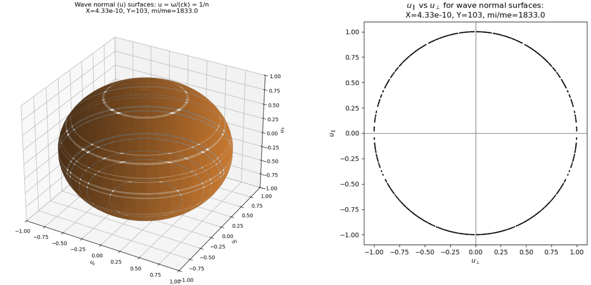

Given that Y is so large ($\gg 1$) but still less than $\mu$, it is in region 9 (convince yourself of this by looking at CMA diagram). Thus, we have the R-wave in parallel propagation and the O-wave in perpendicular propagation. 

nice


--------
# XI
#### Electrostatic waves are a special subset of plasma waves where the electric field $\mathbf{E}$ can be represented by a scalar potential $\phi$ such that $\mathbf{E}=-\nabla \phi$. Use this along with Maxwell's equations to derive the dispersion relation for electrostatic waves in terms of the wavenumber $\mathbf{k}$ and dimensionless dielectric tensor $\mathbf{K}$. For what condition is the electrostatic dispersion relation a good approximation? What does this condition tell us qualitatively about the wavelength and phase velocity of electrostatic waves?

---------

$$
\mathbf{E} = -\nabla \phi
$$

From Maxwell's equations:

$$
\nabla \times \mathbf{E} = -\frac{\partial \mathbf{B}}{\partial t} \to \nabla \times (-\nabla \phi) = -\frac{\partial \mathbf{B}}{\partial t}
$$

$$
\frac{\partial \mathbf{B}}{\partial t} = 0
$$

No time-varying magnetic field, so just electrostatic wave confirmed.

Fourier transform with assumed perturbations $\propto e^{i(\mathbf{k} \cdot \mathbf{r} - \omega t)}$:

$$
\phi = \phi_0 e^{i(\mathbf{k} \cdot \mathbf{r} - \omega t)}
$$

$$
\nabla \phi = \nabla( \phi_0 e^{i(\mathbf{k} \cdot \mathbf{r} - \omega t)} )
$$

$$
\nabla \phi = i \mathbf{k} \phi_0 e^{i(\mathbf{k} \cdot \mathbf{r} - \omega t)} 
$$

$$
\nabla \phi = i \mathbf{k} \phi
$$

and 

$$
\mathbf{E} = -i \mathbf{k} \phi
$$

From Maxwell, $\nabla \cdot \mathbf{D} = \rho_{free}$, but charges in medium are bound so:

$$
\nabla \cdot \mathbf{D} = 0 
$$

$$
i \mathbf{k} \cdot \mathbf{D} = 0
$$

$$
\mathbf{k} \cdot \mathbf{D} = 0 
$$
Ok noted. Now:

$$
\mathbf{D} = \overleftrightarrow{\varepsilon} \cdot \mathbf{E}
$$

Where $\overleftrightarrow{\varepsilon}$ is effective dielectric permittivity tensor $\overleftrightarrow{\varepsilon} = \varepsilon_0 \mathbf{I} - \frac{\overleftrightarrow{\sigma}}{i \omega}$ and effective dielectric tensor is $\mathbf{K}=1-\frac{\overleftrightarrow{\sigma}}{i \omega \varepsilon_0}$. So substituting these expressions in for our electric displacement field.

$$
\mathbf{D} = (\varepsilon_0 \mathbf{I} - \frac{\overleftrightarrow{\sigma}}{i \omega}) \cdot \mathbf{E}
$$

$$
\mathbf{D} = \varepsilon_0 (\mathbf{I} - \frac{\overleftrightarrow{\sigma}}{i \omega \varepsilon_0}) \cdot \mathbf{E}
$$

$$
\mathbf{D} = \varepsilon_0 \mathbf{K} \cdot \mathbf{E}
$$

Knowing $\mathbf{k} \cdot \mathbf{D} =0$ and $\mathbf{E} = -i \mathbf{k} \phi$: 

$$
\mathbf{k} \cdot (\varepsilon_0 \mathbf{K} \cdot \mathbf{E}) =0 
$$

$$
\mathbf{k} \cdot (\varepsilon_0 \mathbf{K} \cdot - i \mathbf{k} \phi) =0 
$$

$$
-i \varepsilon_0 \phi \mathbf{k} \cdot (\mathbf{K} \cdot \mathbf{k}) = 0
$$

$$
\therefore \mathbf{k} \cdot (\mathbf{K} \cdot \mathbf{k}) = 0 
$$

Behold the electrostatic dispersion relation.

nice

Let's now look at the general form of the wave equation ($\mathbf{n}$ is index of refraction):

$$
\mathbf{n} \times (\mathbf{n} \times \mathbf{E}) - \mathbf{K} \cdot \mathbf{E} = 0
$$

Using vector identity $\mathbf{a} \times (\mathbf{a} \times \mathbf{b}) = \mathbf{a}(\mathbf{a} \cdot \mathbf{b}) - a^2 \mathbf{b}$:

$$
\mathbf{n} \times (\mathbf{n} \times \mathbf{E}) = \mathbf{n}(\mathbf{n} \cdot \mathbf{E}) - n^2 \mathbf{E}
$$

$$
\mathbf{n} \times (\mathbf{n} \times \mathbf{E}) = n^2 \mathbf{E_{\parallel}} - n^2 (\mathbf{E_{\parallel}}+\mathbf{E_{\perp}})
$$

$$
\mathbf{n} \times (\mathbf{n} \times \mathbf{E}) = -n^2 \mathbf{E_{\perp}}
$$

Returning to wave equation:

$$
-n^2 \mathbf{E_{\perp}}- \mathbf{K} \cdot (\mathbf{E_{\parallel}}+\mathbf{E_{\perp}}) = 0
$$

$$
-n^2 \mathbf{E_{\perp}}- \mathbf{K} \cdot \mathbf{E_{\parallel}} - \mathbf{K} \cdot \mathbf{E_{\perp}} = 0
$$

$$
-\mathbf{K} \cdot \mathbf{E_{\parallel}} = (n^2 \mathbf{I} + \mathbf{K}) \mathbf{E_{\perp}}
$$

For an electrostatic wave, $\mathbf{E}$ is parallel to $\mathbf{k}$ (from $\mathbf{E} = -i \mathbf{k} \phi$) so $\mathbf{E_{\perp}} \approx 0$, and so then $\mathbf{E} \approx \mathbf{E_{\parallel}}$. Thus, we want to know the sufficient condition for which $\mathbf{E_{\perp}}$ is small compared to $\mathbf{E_{\parallel}}$. 

From our last equation, if $n^2$ is very large compared to the matrix entries of $\mathbf{K}$, then we can say $n^2 \mathbf{I} + \mathbf{K} \approx n^2 \mathbf{I}$:

$$
-\mathbf{K} \cdot \mathbf{E_{\parallel}} \approx n^2 \mathbf{I} \mathbf{E_{\perp}}
$$

$$
\mathbf{E_{\perp}} \approx -\frac{\mathbf{K}}{n^2} \cdot \mathbf{E_{\parallel}}
$$

Thus the condition for the electrostatic approximation where $\mathbf{E_{\perp}} \approx 0$ is that $n^2$ must be much much greater than any element in $\mathbf{K}$, namely:

$$
n^2 \gg |K_{ij}|
$$

Cause then $\frac{\mathbf{E_{\perp}}}{\mathbf{E_{\parallel}}} \ll 1$ and so $\mathbf{E}$ is mostly $\mathbf{E_{\parallel}}$. And this is when the electrostatic approximation, in which the field is treated as longitudinal ($\mathbf{E} \parallel \mathbf{k}$), is good.

nice 

Let's check out what this tells us.

$$
n^2 = \frac{c^2 k^2}{\omega^2}, v_{\phi} = \frac{\omega}{k}
$$

$$
n^2 = \frac{c^2}{v_{\phi}^2}
$$

Qualitatively, from our electrostatic approximation condition, large $n^2$ means large $\frac{k^2}{\omega^2}$ where for a given $\omega$ that means $\mathbf{k}$ is large. Since $k = \frac{2\pi}{\lambda}$, electrostatic waves under this condition have small wavelengths. Also, since $n^2 = \frac{c^2}{v_{\phi}^2}$, large $n^2 $ means the phase velocity is also small and much less than the speed of light. 

nice

---------

# XII
#### Consider the propagation of an electromagnetic wave subject to constant collisions. Introduce an electron-ion collisional term, $\nu_{ei}$ times the velocity, on the right-hand-side of our equations of motion. Note that $\nu_{ei}$ is the electron-ion collision frequency. Write the expression for the conductivity tensor. Which of the conductivity components controls current flow along the parallel (to $\mathbf{B_0}$) electric field direction (called the parallel current)? Which of the conductivity components controls current flow along the perpendicular (to $\mathbf{B_0}$) electric field direction (called the Pederson current)? Which of the conductivity components controls current flow in the $\mathbf{E} \times \mathbf{B}$ direction (called the Hall current)? Identify the direction of each component. Then, perform the analysis for CPDR to arrive at the effective dielectric tensor, $\mathbf{K}$, now with a collisional term. Using this, derive the dispersion relation for electromagnetic waves (the ordinary mode waves) in the presence of $\nu_{ei}$ for an isotropic plasma. 

-----

Let's say $\mathbf{B_0}=B_0 \mathbf{\hat{z}}$ in cartesian coordinate system $(x,y,z)$. We assume electromagnetic waves produce perturbations $\mathbf{E_1}$, $\mathbf{B_1}$, and species velocity $\mathbf{v_{j1}}$ with constant density $n_0 = n_e = n_i $ and $\mathbf{v_{j0}} = 0 $. The electron-ion collisional term implies dealing with two species: subscript $j=e$ for electrons and subscript $j=i$ for ions. 

Linearized equation of motion:

$$
m_j \frac{d \mathbf{v_{j1}}}{dt} = q_j (\mathbf{E_1} + \mathbf{v_{j1}} \times \mathbf{B_0}) - m_j \nu_{ei} \mathbf{v_{j1}}
$$

Fourier analysis:

$$
m_j(-i\omega) \mathbf{v_{j1}} = q_j(\mathbf{E_1} + \mathbf{v_{j1}} \times \mathbf{B_0}) - m_j \nu_{ei} \mathbf{v_{j1}}
$$

$$
m_j(\nu_{ei} - i\omega) \mathbf{v_{j1}} = q_j(\mathbf{E_1} + \mathbf{v_{j1}} \times \mathbf{B_0}) 
$$

Components of $\mathbf{v_{j1}}$:

$$
m_j (\nu_{ei} - i\omega) v_{xj} = q_j (E_x + B_0 v_{yj})
$$

$$
m_j (\nu_{ei} - i\omega) v_{yj} = q_j (E_y + B_0 v_{xj})
$$

$$
m_j(\nu_{ei} - i\omega) v_{zj} = q_j (E_{z})
$$

Perpendicular components:

$$
m_j(\nu_{ei} -i\omega) v_{xj} - q_j B_0 v_{yj} = q_j E_x
$$

$$
m_j(\nu_{ei} -i\omega) v_{yj} + q_j B_0 v_{xj} = q_j E_y
$$

$$
\begin{pmatrix} m_j(\nu_{ei}-i\omega) & -q_j B_0 \\\\ q_j B_0 & m_j(\nu_{ei} - i\omega) \end{pmatrix} \begin{pmatrix} v_{xj} \\\\ v_{yj} \end{pmatrix} = q_j \begin{pmatrix} E_x \\\\ E_y \end{pmatrix}
$$

$$
\operatorname{Det} = m_j^2 (\nu_{ei} - i\omega)^2 + (qB_0)^2 
$$

Inverse:

$$
\begin{pmatrix} v_{xj} \\\\ v_{yj} \end{pmatrix} = \frac{q_j}{m_j^2 (\nu_{ei} - i\omega)^2 + (q_jB_0)^2 } \begin{pmatrix} m_j(\nu_{ei}-i\omega) & q_j B_0 \\\\ -q_j B_0 & m_j(\nu_{ei} - i\omega) \end{pmatrix} \begin{pmatrix} E_x \\\\ E_y \end{pmatrix}
$$ 

$$
v_{xj} = \frac{q_j}{m_j^2 (\nu_{ei} - i\omega)^2 + (q_jB_0)^2 } (m_j(\nu_{ei}-i\omega)E_x +q_j B_0 E_y)
$$

$$
v_{yj} = \frac{q_j}{m_j^2 (\nu_{ei} - i\omega)^2 + (q_jB_0)^2 } (- q_j B_0 E_x + m_j(\nu_{ei}-i\omega)E_y )
$$

Oh hey the species (electron or ion) cyclotron frequency is $\epsilon_j \omega_{cj}=\frac{q_j B_0}{m_j} \to q_j B_0 = m_j \epsilon_j \omega_{cj}$, so we can substitute it in:

$$
v_{xj} = \frac{q_j}{m_j^2 (\nu_{ei} - i\omega)^2 +m_j^2 \omega_{cj}^2} (m_j(\nu_{ei}-i\omega) E_x +m_j \epsilon_j \omega_{cj}E_y) 
$$

$$
\to v_{xj} = \frac{q_j}{m_j} \frac{(\nu_{ei} -i\omega)E_x + \epsilon_j \omega_{cj} E_y}{(\nu_{ei} - i\omega)^2 + \omega_{cj}^2}
$$

$$
\to v_{yj} = \frac{q_j}{m_j} \frac{- \epsilon_j \omega_{cj} E_x + (\nu_{ei}-i\omega)E_y}{(\nu_{ei}-i\omega)^2 +\omega_{cj}^2}
$$

Parallel component:

$$
\to v_{zj} = \frac{q_j}{m_j} \frac{E_z}{\nu_{ei} - i\omega}
$$

$$
\mathbf{J_j} = n_0 q_j \mathbf{v_{j1}}
$$

The components of $\mathbf{J}$ can be written in terms of components of $\mathbf{E}$ and tensor elements of $\overleftrightarrow{\sigma}$:

$$
\mathbf{J} = \overleftrightarrow{\sigma} \cdot \mathbf{E} \to \begin{pmatrix} J_x \\\\ J_y \\\\ J_z \end{pmatrix} = \begin{pmatrix} \sigma_{xx} & \sigma_{xy} & \sigma_{xz} \\\\ \sigma_{yx} & \sigma_{yy} & \sigma_{yz} \\\\ \sigma_{zx} & \sigma_{zy} & \sigma_{zz} \end{pmatrix} \begin{pmatrix} E_x \\\\ E_y \\\\ E_z \end{pmatrix}
$$

Perpendicular components of current density:

$$
J_{xj} = n_{0} \frac{q_j^2}{m_j} \frac{(\nu_{ei} -i\omega)E_x + \epsilon_j \omega_{cj} E_y}{(\nu_{ei} - i\omega)^2 + \omega_{cj}^2} 
$$

$$
J_{yj} = n_{0} \frac{q_j^2}{m_j} \frac{- \epsilon_j \omega_{cj} E_x + (\nu_{ei}-i\omega)E_y}{(\nu_{ei}-i\omega)^2 +\omega_{cj}^2}
$$

Parallel components of current density:

$$
J_{zj} = n_{0} \frac{q_j^2}{m_j} \frac{E_z}{\nu_{ei} - i\omega}
$$

Since $\omega_{pj}^2 = \frac{n_0 q_j^2}{m_j \varepsilon_0}$ our components of the conductivity tensor are:

$$
\sigma_{xx} = \varepsilon_0 \omega_{pj}^2 \frac{(\nu_{ei} -i\omega)}{(\nu_{ei} - i\omega)^2 + \omega_{cj}^2}, 
\sigma_{xy} = \varepsilon_0 \omega_{pj}^2 \frac{\epsilon_j \omega_{cj}}{(\nu_{ei} - i\omega)^2 + \omega_{cj}^2}
$$

$$
\sigma_{yx} = \varepsilon_0 \omega_{pj}^2 \frac{- \epsilon_j \omega_{cj}}{(\nu_{ei} - i\omega)^2 + \omega_{cj}^2}, \sigma_{yy} = \varepsilon_0 \omega_{pj}^2 \frac{(\nu_{ei} -i\omega)}{(\nu_{ei} - i\omega)^2 + \omega_{cj}^2}
$$

$$
\sigma_{zz} = \varepsilon_ 0 \frac{\omega_{pj}^2}{\nu_{ei} - i\omega}
$$

Thus we have the species conductivity tensor:
$$
\overleftrightarrow{\sigma^{(j)}} = \varepsilon_0 \omega_{pj}^2  \begin{pmatrix}  \frac{(\nu_{ei} -i\omega)}{(\nu_{ei} - i\omega)^2 + \omega_{cj}^2} & \frac{\epsilon_j \omega_{cj}}{(\nu_{ei} - i\omega)^2 + \omega_{cj}^2}  & 0 \\\\ \frac{- \epsilon_j \omega_{cj}}{(\nu_{ei} - i\omega)^2 + \omega_{cj}^2} & \frac{(\nu_{ei} -i\omega)}{(\nu_{ei} - i\omega)^2 + \omega_{cj}^2} & 0 \\\\ 0 & 0 & \frac{1}{\nu_{ei} - i\omega} \end{pmatrix}
$$


And total $\overleftrightarrow{\sigma}$ would be:

$$
\therefore \overleftrightarrow{\sigma} = \sum_{j = e, i}  \overleftrightarrow{\sigma^{(j)}} 
$$

nice

The component of $\overleftrightarrow{\sigma}$ where $J_z = \sigma_{\parallel} E_z$ controls current flow along magnetic field because $\mathbf{B_0} = B_0 \mathbf{\hat{z}}$.

$$
\sigma_{\parallel} = \sigma_{zz}
$$

Component governing parallel current:
$$
\therefore \sigma_{\parallel} = \varepsilon_ 0 \frac{\omega_{pj}^2}{\nu_{ei} - i\omega}
$$

nice

Perpendicular to $\mathbf{B_0}$, current flow is along $\mathbf{\hat{x}}$ or $\mathbf{\hat{y}}$, so $J_x = \sigma_{\perp} E_x$ or $J_y = \sigma_{\perp} E_y$.

$$
\sigma_{\perp} = \sigma_{xx},\sigma_{\perp} = \sigma_{yy}
$$

Component governing Pederson current:
$$
\therefore \sigma_{\perp} = \varepsilon_0 \omega_{pj}^2 \frac{(\nu_{ei} -i\omega)}{(\nu_{ei} - i\omega)^2 + \omega_{cj}^2}
$$

nice

$\mathbf{E} \times \mathbf{B}$ is either in $\mathbf{\hat{x}}$ or $\mathbf{\hat{y}}$, so $J_y = -\sigma_{E \times B} E_x$ or $J_x = \sigma_{E \times B} E_y$.

$$
-\sigma_{E \times B} = \sigma_{yx}, \sigma_{E \times B} = \sigma_{xy}
$$

Component governing Hall current:
$$
\therefore \sigma_{E \times B} = \varepsilon_0 \omega_{pj}^2 \frac{\epsilon_j \omega_{cj}}{(\nu_{ei} - i\omega)^2 + \omega_{cj}^2}
$$

nice

Let's continue our analysis, using the same method as achieving CPDR and applying it here to achieve the effective dielectric tensor with collisionality included. 

Ampère-Maxwell:

$$
\nabla \times \mathbf{B} = \mu_0 \mathbf{J} +\mu_0 \varepsilon_0 \frac{\partial \mathbf{E}}{\partial t}
$$

$$
i\mathbf{k} \times \mathbf{B} = \mu_0 \mathbf{J} - i\omega \mu_0 \varepsilon_0 \mathbf{E}
$$

Combine plasma current with displacement current:

$$
\mathbf{J} - i\omega \varepsilon_0 \mathbf{E} = -i \omega \varepsilon_0 \mathbf{K} \cdot \mathbf{E}
$$

$$
\mathbf{J} = i\omega \varepsilon_0 \mathbf{E} - i\omega \varepsilon_0 \mathbf{K} \cdot \mathbf{E}
$$

$$
\mathbf{J} = i \omega \varepsilon_0 (\mathbf{I} - \mathbf{K}) \cdot \mathbf{E}
$$

Ohm's law:

$$
\mathbf{J} = \overleftrightarrow{\sigma} \cdot \mathbf{E}
$$

$$
\overleftrightarrow{\sigma} = i \omega \varepsilon_0 (\mathbf{I} - \mathbf{K}) 
$$

$$
\mathbf{I} - \mathbf{K} = \frac{\overleftrightarrow{\sigma}}{i\omega \varepsilon_0}
$$

$$
\mathbf{K} = \mathbf{I} + \frac{i}{\omega \varepsilon_0} \overleftrightarrow{\sigma}
$$

The effective dielectric tensor takes the form:

$$
\mathbf{K} = \begin{pmatrix} K_{xx} & K_{xy} & 0 \\\\ K_{yx} & K_{yy} & 0 \\\\ 0 & 0 & K_{zz} \end{pmatrix}
$$

So we can translate components of conductivity tensor to dielectric tensor:

$$
K_{xx} = K_{yy} = 1+\sum_j \frac{i}{\omega \varepsilon_0} \varepsilon_0 \omega_{pj}^2 \frac{\nu_{ei} -i \omega}{(\nu_{ei} - i\omega)^2 +\omega_{cj}^2} = 1+ \sum_j \frac{-i^2}{\omega} \omega_{cj}^2  \frac{\omega + i\nu_{ei}}{(-i(\omega+i \nu_{ei}))^2 +\omega_{cj}^2} = 1-\sum_j \frac{\omega_{pj}^2}{\omega} \frac{\omega+i\nu_{ei}}{(\omega+i\nu_{ei})^2 -\omega_{cj}^2}
$$

$$
K_{xy} = 0 + \sum_j \frac{i}{\omega \varepsilon_0} \varepsilon_0 \omega_{pj}^2 \frac{\epsilon_j \omega_{cj}}{(\nu_{ei} - i\omega)^2 +\omega_{cj}^2} = -i \sum_j \frac{\omega_{pj}^2}{\omega} \frac{\epsilon_j \omega_{cj}}{(\omega +i\nu_{ei})^2 -\omega_{cj}^2}
$$

$$
K_{yx} = 0 + \sum_j \frac{i}{\omega \varepsilon_0} \varepsilon_0 \omega_{pj}^2 \frac{-\epsilon_j \omega_{cj}}{(\nu_{ei}-i\omega)^2 +\omega_{cj}^2} = i\sum_j \frac{\omega_{pj}^2}{\omega} \frac{\epsilon_j \omega_{cj}}{(\omega +i\nu_{ei})^2 -\omega_{cj}^2}
$$

$$
K_{zz} = 1+\sum_j \frac{i}{\omega \varepsilon_0} \varepsilon_0 \omega_{pj}^2 \frac{1}{\nu_{ei} - i\omega} = 1-\sum_j \frac{\omega_{pj}^2}{\omega(\omega+i\nu_{ei})}
$$

$$
\therefore \mathbf{K} = \begin{pmatrix} 1-\sum_j \frac{\omega_{pj}^2}{\omega} \frac{\omega+i\nu_{ei}}{(\omega+i\nu_{ei})^2 -\omega_{cj}^2} & -i \sum_j \frac{\omega_{pj}^2}{\omega} \frac{\epsilon_j \omega_{cj}}{(\omega +i\nu_{ei})^2 -\omega_{cj}^2} & 0 \\\\ i\sum_j \frac{\omega_{pj}^2}{\omega} \frac{\epsilon_j \omega_{cj}}{(\omega +i\nu_{ei})^2 -\omega_{cj}^2} & 1-\sum_j \frac{\omega_{pj}^2}{\omega} \frac{\omega+i\nu_{ei}}{(\omega+i\nu_{ei})^2 -\omega_{cj}^2} & 0 \\\\ 0 & 0 & 1-\sum_j \frac{\omega_{pj}^2}{\omega(\omega+i\nu_{ei})} \end{pmatrix}
$$

nice

Let's now derive the dispersion relation for the ordinary mode wave in the presence of the collisional term in an isotropic plasma. From Maxwell:

$$
i\mathbf{k} \times \mathbf{E} = i\omega \mathbf{B}
$$

$$
i\mathbf{k} \times \mathbf{B} = -i\omega \varepsilon_0 \mu_0 \mathbf{K} \times \mathbf{E}
$$

Substituting for $\mathbf{B}$:

$$
i\mathbf{k} \times (\frac{1}{\omega} \mathbf{k} \times \mathbf{E}) = -i\omega \varepsilon_0 \mu_0 \mathbf{K} \cdot \mathbf{E}
$$

$$
\mathbf{k} \times (\mathbf{k} \times \mathbf{E}) = -\omega^2 \varepsilon_0 \mu_0 \mathbf{K} \cdot \mathbf{E}
$$

Since $\varepsilon_0 \mu_0 = \frac{1}{c^2}$:

$$
\mathbf{k} \times (\mathbf{k} \times \mathbf{E}) + \frac{\omega^2}{c^2} \mathbf{K} \cdot \mathbf{E} =0 
$$

For an isotropic plasma, $\mathbf{K} \to K$ (dielectric constant instead of tensor) - isotropy means same in every direction:

$$
\mathbf{k} \times (\mathbf{k} \times \mathbf{E}) + \frac{\omega^2}{c^2} K \mathbf{E}=0
$$

Using vector identity $\mathbf{k} \times (\mathbf{k} \times \mathbf{E}) = \mathbf{k} (\mathbf{k} \cdot \mathbf{E}) -k^2 \mathbf{E}$:

$$
\mathbf{k} (\mathbf{k} \cdot \mathbf{E}) -k^2 \mathbf{E}+ \frac{\omega^2}{c^2} K \mathbf{E}=0
$$

But the ordinary wave is a transverse electromagnetic wave where $\mathbf{E} \perp \mathbf{k}$  so:

$$
\mathbf{k} \cdot \mathbf{E} = 0
$$

$$
-k^2 \mathbf{E}+ \frac{\omega^2}{c^2} K \mathbf{E}=0
$$

$$
-k^2 + \frac{\omega^2}{c^2} K = 0
$$

$$
K = \frac{c^2 k^2}{\omega^2}
$$

Given our simplified conditions (isotropic unmagnetized plasma with $\nu_{ei}$ so just electrons and ions) then $B_0 \to 0$, meaning $\omega_{cj} \to 0$, so $\mathbf{K}$ for either electron or ion becomes:

$$
\mathbf{K} = \begin{pmatrix} 1-\frac{\omega_p^2}{\omega}\frac{\omega+i\nu_{ei}}{(\omega+i\nu_{ei})^2} & 0& 0 \\\\ 0&1-\frac{\omega_p^2}{\omega}\frac{\omega+i\nu_{ei}}{(\omega+i\nu_{ei})^2}  & 0 \\\\ 0&0& 1-\frac{\omega_p^2}{\omega(\omega+i\nu_{ei})} \end{pmatrix} = \begin{pmatrix} 1-\frac{\omega_p^2}{\omega(\omega+i\nu_{ei})} & 0& 0 \\\\ 0&1-\frac{\omega_p^2}{\omega(\omega+i\nu_{ei})}  & 0 \\\\ 0&0& 1-\frac{\omega_p^2}{\omega(\omega+i\nu_{ei})} \end{pmatrix}
$$

$$
\mathbf{K} = K \mathbf{I}
$$

So:

$$
K = 1-\frac{\omega_p^2}{\omega(\omega+i\nu_{ei})}
$$

$$
\therefore \frac{c^2 k^2}{\omega^2} = 1-\frac{\omega_p^2}{\omega (\omega + i\nu_{ei})}
$$

nice, and there we have it