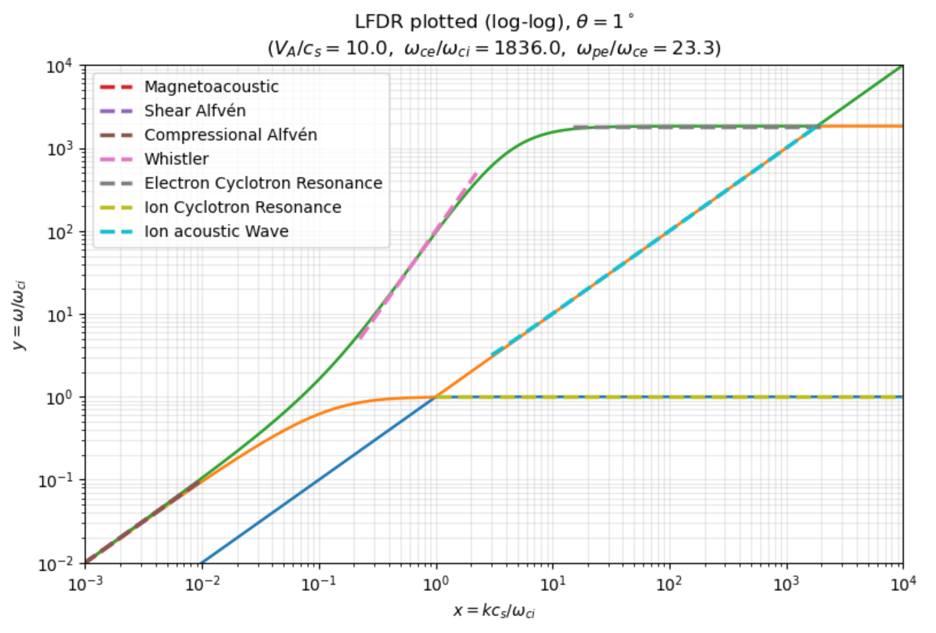
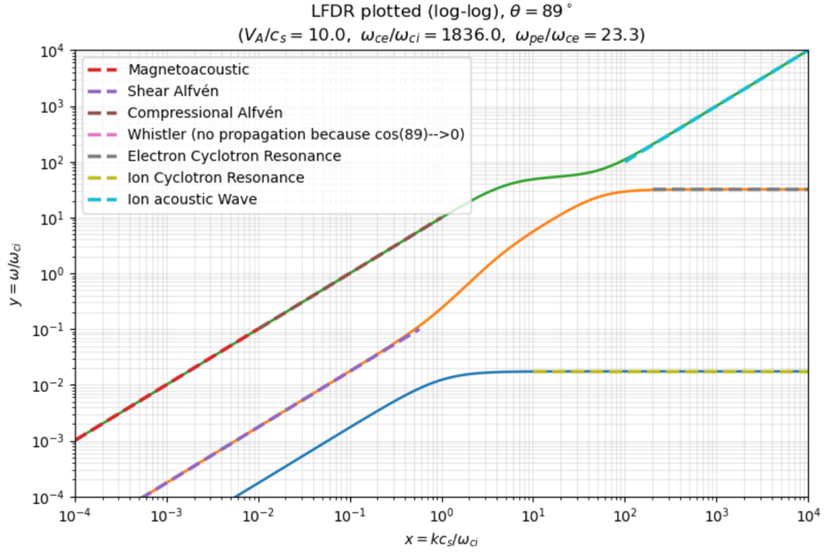

$\to$ [I. Alfvén waves](#i)

$\to$ [II. LFDR Stringer diagrams](#ii)

$\to$ [III. Two-stream instability](#iii)


## Summary of my solutions on this page


<div style="border: 1px solid #ccc; padding: 1rem; border-radius: 8px;">
It is my honor to introduce the following solutions of problems pertaining to treating plasma as a fluid with a bulk velocity and pressure and density and etc etc. We get so much further cool physics and waves and instabilities. 

We start by deriving two famous MHD waves: the shear and compressional Alfvén waves, knowing that we can see these waves even in a cold fluid plasma. 

Next, we take a look at the governing dispersion relation for plasma fluids - the Low Frequency Dispersion Relation - which can be reduced to a cubic function with three branches of coupling waves. See for yourself a couple versions of Stringer plots that display fluid waves in different regions of frequency and wavenumber. 

We then start with the fluid equations to analyze an instability that arises from two electron streams propagating together in opposite directions. We can even analytically derive the maximum rate at which this particular instability grows.

</div>


--------

# I
#### The ideal MHD fluid equations for a cold plasma are:
$$
\rho \frac{d \mathbf{v}}{dt} = \mathbf{J} \times \mathbf{B}
$$

$$
0 = \mathbf{E} + \mathbf{v} \times \mathbf{B}
$$


#### Use the above equations together with Maxwell's equations to obtain the dispersion relations for the shear and compressional Alfvén waves. Draw the wave normal surfaces for the two Alfvén waves. In what region of the CMA diagram are the dispersion relations for the shear and compressional Alfvén waves valid? 

--------

We begin with the following equilibrium:

$$
\mathbf{B} = \mathbf{B}_0 + \mathbf{B}_1, \quad \mathbf{v} = \mathbf{v}_1, \quad \rho = \rho_0 + \rho_1
$$

Since $\mathbf{B}_0$ is uniform, $\nabla \times \mathbf{B}_0 = 0$. And the momentum equation becomes:

$$
\rho_0 \frac{\partial \mathbf{v}}{\partial t} = \mathbf{J}_1 \times \mathbf{B}_0 = \frac{1}{\mu_0} (\nabla \times \mathbf{B}_1) \times \mathbf{B}_0
$$

Induction equation becomes (from Faraday's $\frac{\partial \mathbf{B}}{\partial t} = -\nabla \times \mathbf{E}$ and ideal Ohm's $\mathbf{E}=-\mathbf{v} \times \mathbf{B}$):

$$
\frac{\partial \mathbf{B}_1}{\partial t} = \nabla \times (\mathbf{v} \times \mathbf{B}_0)
$$

When assuming plane-wave perturbations ($\mathbf{v}, \mathbf{B}_1 \propto e^{i(\mathbf{k} \cdot \mathbf{r} - \omega t)}$ so $\frac{\partial}{\partial t} \to -i \omega$, $\nabla \to i \mathbf{k}$), the induction equation gives:

$$
-i \omega \mathbf{B}_1 = i\mathbf{k} \times (\mathbf{v} \times \mathbf{B}_0)
$$

$$
-\omega \mathbf{B}_1 = \mathbf{k} \times (\mathbf{v} \times \mathbf{B}_0)
$$

$$
-\omega \mathbf{B}_1 = \mathbf{v}(\mathbf{k} \cdot \mathbf{B}_0) - \mathbf{B}_0 (\mathbf{k} \cdot \mathbf{v})
$$

$$
\omega \mathbf{B}_1 =\mathbf{B}_0 (\mathbf{k} \cdot \mathbf{v}) - \mathbf{v}(\mathbf{k} \cdot \mathbf{B}_0) 
$$

Momentum equation gives:

$$
-i \omega \rho_0 \mathbf{v} = \frac{1}{\mu_0} (i \mathbf{k} \times \mathbf{B}_1) \times \mathbf{B}_0
$$

$$
-\omega \rho_0 \mathbf{v} = \frac{1}{\mu_0} (\mathbf{k} \times \mathbf{B}_1) \times \mathbf{B}_0
$$

$$
-\omega \rho_0 \mathbf{v} = \frac{1}{\mu_0} (\mathbf{B}_1 (\mathbf{k} \cdot \mathbf{B}_0) - \mathbf{k} (\mathbf{B}_1 \cdot \mathbf{B}_0))
$$

$$
\omega \rho_0 \mathbf{v} = \frac{1}{\mu_0}(\mathbf{k} (\mathbf{B}_1 \cdot \mathbf{B}_0) -  \mathbf{B}_1 (\mathbf{k} \cdot \mathbf{B}_0) )
$$

Letting the equilibrium magnetic field point in the z-direction $\mathbf{B}_0 = B_0 \mathbf{\hat{z}}$ and wavevector lie in the x-z plane:

$$
\mathbf{k} = k_{\perp} \mathbf{\hat{x}} + k_{\parallel} \mathbf{\hat{z}} 
$$

So from the induction relation we get:


$$
\omega \mathbf{B_1} = B_0 \hat{\mathbf{z}} (k_{\perp} v_x + k_{\parallel} v_z) - B_0 k_{\parallel} (v_x \hat{\mathbf{x}} + v_y \hat{\mathbf{y}} + v_z \hat{\mathbf{z}})
$$

$$
\omega \mathbf{B_1} = -B_0 k_{\parallel} v_x \hat{\mathbf{x}} - B_0 k_{\parallel} v_y \hat{\mathbf{y}} + B_0 k_{\perp} v_x \hat{\mathbf{z}}
$$

$$
B_{1,x} = -\frac{B_0 k_{\parallel}}{\omega} v_x, \quad B_{1,y} = -\frac{B_0 k_{\parallel}}{\omega} v_y, \quad B_{1,z} = \frac{B_0 k_{\perp}}{\omega} v_x
$$

Substitute into the momentum equation:

$$
\omega \rho_0 (v_x \hat{\mathbf{x}} + v_y \hat{\mathbf{y}} + v_z \hat{\mathbf{z}}) = \frac{1}{\mu_0} ((k_{\perp} \hat{\mathbf{x}} + k_{\parallel} \hat{\mathbf{z}})B_0 B_{1, z} - \mathbf{B_1} (B_0 k_{\parallel}))
$$

$$
\omega \rho_0 (v_x \hat{\mathbf{x}} + v_y \hat{\mathbf{y}} + v_z \hat{\mathbf{z}}) = \frac{B_0^2}{\mu_0 \omega} (k_{\perp}^2 v_x \hat{\mathbf{x}}+k_{\perp} k_{\parallel} v_x \hat{\mathbf{z}} + k_{\parallel}^2 v_x \hat{\mathbf{x}} + k_{\parallel}^2 v_y \hat{\mathbf{y}} - k_{\perp} k_{\parallel} v_x \hat{\mathbf{z}})
$$

$$
\omega \rho_0 (v_x \hat{\mathbf{x}} + v_y \hat{\mathbf{y}} + v_z \hat{\mathbf{z}}) = \frac{B_0^2}{\mu_0 \omega} ((k_{\perp}^2 + k_{\parallel}^2) v_x \hat{\mathbf{x}} + k_{\parallel}^2 v_y \hat{\mathbf{y}})
$$

$$
\omega^2 (v_x \hat{\mathbf{x}} + v_y \hat{\mathbf{y}} + v_z \hat{\mathbf{z}}) = \frac{B_0^2}{\mu_0 \rho_0} ((k_{\perp}^2 + k_{\parallel}^2) v_x \hat{\mathbf{x}} + k_{\parallel}^2 v_y \hat{\mathbf{y}})
$$

We know Alfvén speed to be $v_A^2 = \frac{B_0^2}{\mu_0 \rho_0}$, so the component equations are:

$$
\omega^2 v_x = v_A^2 (k_{\perp}^2 + k_{\parallel}^2)v_x, \quad \omega^2 v_y = v_A^2 k_{\parallel}^2 v_y, \quad \omega^2 v_z = 0
$$

Since $k^2 = k_{\perp}^2 + k_{\parallel}^2$:

$$
(\omega^2 - v_A^2 k^2) v_x = 0, \quad (\omega^2 - v_A^2 k_{\parallel}^2)v_y = 0 
$$

Now we can extract the dispersion relations. For the shear Alfvén wave, $v_y \neq 0$ and so with motion perpendicular to both $\mathbf{k}$ and $\mathbf{B}_0$:

$$
\omega^2 - v_A^2 k_{\parallel}^2 = 0 
$$

And behold the dispersion relation for the shear Alfvén wave:

$$
\omega ^2 = k_{\parallel}^2 v_A^2
$$

For the compressional Alfvén wave, $v_x \neq 0$ with motion in the $\mathbf{k} - \mathbf{B}_0$ plane and perpendicular to $\mathbf{B}_0$:

$$
\omega^2 - v_A^2 k^2 = 0
$$

And behold the dispersion relation for the compressional Alfvén wave:
$$
\omega^2 = k^2 v_A^2
$$

nice

If we draw our wave normal surface for these two MHD Alfvén waves with $u_{\perp}$ on the x-axis and $u_{\parallel}$ on the y-axis with:

$$
u = \frac{\omega}{k c}
$$

We get that the inner dumbell lemniscoid is the shear Alfvén wave and the other spheroid is the compressional Alfvén wave:


To know where in the CMA diagram the Alfvén wave dispersions are valid, we know that the MHD approximation is that $\omega \ll \omega_{ci} \ll \omega_{ce}$. We can write $\omega \ll \omega_{ci}$ as:

$$
\omega \ll \frac{\omega_{ce}}{m_i / m_e} \to \frac{\omega_{ce}}{\omega} \gg \frac{m_i}{m_e} = \mu
$$

So the shear and compressional Alfvén waves are valid in the upper part of the CMA diagram where $\omega_{ce} / \omega \gg \mu$, which is in Region 13 wherein we see a dumbell lemniscoid nested in a spheroid. 


--------

# II

#### For ($\omega_{pe} / \omega_{ce} = 23.3, v_A / c_s = 10, c/v_A = 10^3, m_i / m_e = 1836$), plot Stringer diagrams of the Low Frequency Dispersion Relation (LFDR) for the following angles:

- $\theta = 1°$
- $\theta = 89°$

#### On each plot label the following: Shear and Compressional Alfén Wave, Magnetoacoustic Wave, Ion Acoustic Wave, Whistler Wave, Electron Cyclotron Resonance, Ion Cyclotron Resonance.

--------

The Low Frequency Dispersion Relation (LFDR) describes waves from the plasma fluid equations in the low frequency region in which we neglect terms of order $m_e / m_i$:

$$
\left(1 - \frac{\omega^2}{k^2 v_A^2} - \frac{\omega^2}{\omega_{ce} \omega_{ci}} + \frac{k^2 c_s^2 \sin^2 \theta}{\omega^2 - k^2 c_s^2}\right) \left(\cos^2 \theta - \frac{\omega^2}{k^2 v_A^2} - \frac{\omega^2}{\omega_{ce} \omega_{ci}} \right) = \frac{\omega^2 \cos^2 \theta}{\omega_{ci}^2}
$$

Where $\theta$ is the angle between the direction of propagation and the static magnetic field. 

Stringer diagrams are plotted with $\omega / \omega_{ci}$ on the y-axis and $k c_s / \omega_{ci}$ on the x-axis:

$$
x = \frac{k c_s}{\omega_{ci}} \to k^2 = \frac{\omega_{ci}^2 x^2}{c_s^2}, \quad y = \frac{\omega}{\omega_{ci}} \to \omega^2 = y^2 \omega_{ci}^2
$$

Substituting these back into the LFDR and then simplifying the expression:

$$
\left(1 - \frac{y^2 \omega_{ci}^2}{\frac{\omega_{ci}^2 x^2}{c_s^2} v_A^2} - \frac{y^2 \omega_{ci}^2}{\omega_{ce} 
\omega_{ci}}  + \frac{\frac{\omega_{ci}^2 x^2}{c_s^2} c_s^2 \sin^2 \theta}{y^2 \omega_{ci}^2 - \frac{\omega_{ci}^2 x^2}{c_s^2} c_s^2}\right) \left(\cos^2\theta - \frac{y^2 \omega_{ci}^2}{\frac{\omega_{ci}^2 x^2}{c_s^2} v_A^2} - \frac{y^2 \omega_{ci}^2}{\omega_{ce} \omega_{ci}} \right) = \frac{y^2 \omega_{ci}^2 \cos^2 \theta}{\omega_{ci}^2}
$$

$$
\left(1 - \frac{c_s^2}{v_A^2} \frac{y^2}{x^2} - \frac{\omega_{ci}}{\omega_{ce}}y^2 + \frac{x^2 \sin^2 \theta}{y^2 - x^2} \right) \left(\cos^2 \theta - \frac{c_s^2}{v_A^2} \frac{y^2}{x^2} - \frac{\omega_{ci}}{\omega_{ce}} y^2 \right) = y^2 \cos^2 \theta 
$$

$$
\left(1 - \left(\frac{c_s^2}{v_A^2 x^2} + \frac{\omega_{ci}}{\omega_{ce}} \right)y^2 + \frac{x^2 \sin^2 \theta}{y^2 - x^2} \right) \left(\cos^2 \theta - \left(\frac{c_s^2}{v_A^2 x^2} + \frac{\omega_{ci}}{\omega_{ce}} \right)y^2 \right) = y^2 \cos^2 \theta
$$

$$
\left((y^2-x^2) - (y^2 - x^2)\left(\frac{c_s^2}{v_A^2 x^2} + \frac{\omega_{ci}}{\omega_{ce}} \right)y^2 +x^2 \sin^2 \theta \right) \left(\cos^2 \theta - \left(\frac{c_s^2}{v_A^2 x^2} + \frac{\omega_{ci}}{\omega_{ce}} \right)y^2 \right) = y^2 (y^2 - x^2) \cos^2 \theta
$$

$$
\left(y^2 - x^2 - \left(\frac{c_s^2}{v_A^2 x^2} + \frac{\omega_{ci}}{\omega_{ce}} \right) (y^4 - y^2 x^2) + x^2 \sin^2 \theta \right) \left(\cos^2 \theta - \left(\frac{c_s^2}{v_A^2 x^2} + \frac{\omega_{ci}}{\omega_{ce}} \right)y^2 \right) = y^2 (y^2 - x^2) \cos^2 \theta
$$

Let's let $s = \frac{c_s^2}{v_A^2 x^2} + \frac{\omega_{ci}}{\omega_{ce}}$:

$$
(y^2 -x^2 -s(y^4 -y^2 x^2) +x^2\sin^2 \theta)(\cos^2 \theta - sy^2) = y^2 (y^2 -x^2) \cos^2 \theta
$$

After further simplification this becomes:

$$
s^2 y^6 + (-s(1+ \cos^2 \theta) - s^2 x^2 - \cos^2 \theta) y^4 + \cos^2 \theta(1+x^2 +2sx^2)y^2 - x^2 \cos^4 \theta = 0
$$

If we say $y^2 = q$ then this becomes a cubic in $q$ with 4 coefficients:

$$
A_3 = s^2, \quad A_2 = -s(1+\cos^2\theta) - s^2x^2 - \cos^2 \theta, \quad A_1 = \cos^2 \theta(1+ x^2 +2sx^2), \quad A_0 = -x^2 \cos^4 \theta 
$$

The following code sets our problem up and includes the function for solving the LFDR in cubic form:

```python
import numpy as np
import matplotlib.pyplot as plt

# conditions
omega_pe_over_omega_ce = 23.3
Va_over_cs = 10.0
c_over_Va = 1e3
mi_over_me = 183600000.0 # = ω_ce/ω_ci  

theta_deg = # change this to either 1 or 89
theta = np.deg2rad(theta_deg)
           
a2 = Va_over_cs**2       
c2 = np.cos(theta)**2

def lfdr_roots_y2(x: float):
    """
    solve LFDR for q = y^2 at a given x = k c_s / ω_ci

    I reduced LFDR to a cubic in q
    then filtered:
      - complex roots (keep ~real)
      - negative q
      - pole roots near q = x^2 (original LFDR has a pole at ω^2 = k^2 c_s^2)
    """
    if x <= 0:
        return []

    # s = 1/(x^2 (V_A/c_s)^2) + 1/(ω_ce/ω_ci)
    s = 1.0 / (x**2 * a2) + 1.0 / mi_over_me

    # cubic: A3 q^3 + A2 q^2 + A1 q + A0 = 0
    A3 = s**2
    A2 = -s*(c2 + 1.0) - s**2 * x**2 - c2
    A1 = c2 * (1.0 + x**2 + 2.0*s*x**2)
    A0 = -x**2 * c2**2

    roots = np.roots([A3, A2, A1, A0])

    q_list = []
    for r0 in roots:
        if abs(r0.imag) < 1e-8:
            q = float(r0.real)
            if q > 0 and abs(q - x**2) > 1e-10:
                q_list.append(q)

    q_list.sort()
    return q_list

# build curve data 
x_min = 1e-4 # change this
x_max = 1e6 # change this
N = 2000
x_grid = np.logspace(np.log10(x_min), np.log10(x_max), N)

y_br = np.full((N, 3), np.nan, dtype=float)

for i, x in enumerate(x_grid):
    q_roots = lfdr_roots_y2(x)
    y_roots = [np.sqrt(q) for q in q_roots]
    for j in range(min(3, len(y_roots))):
        y_br[i, j] = y_roots[j]
```

We will overlay the dispersion functions for each wave the question wants labeled, so let's write each of them in terms of $x$ and $y$. 

Beginning with the waves in the MHD region ($
\omega < \omega_{ci}$):

$$
\text{Magnetoacoustic wave} \to \omega^2 = k^2 (v_A^2 + c_s^2 \sin^2 \theta)
$$

$$
\omega_{ci}^2 y^2 = \frac{\omega_{ci}^2 x^2}{c_s^2}(v_A^2 + c_s^2 \sin^2 \theta)
$$

$$
y = x \sqrt{\frac{v_A^2}{c_s^2} + \sin^2 \theta}
$$

$$
\text{Shear Alfvén wave} \to \omega^2 = k^2 v_A^2 \cos^2 \theta
$$

$$
\omega_{ci}^2 y^2 = \frac{\omega_{ci}^2 x^2 }{c_s^2} v_A^2 \cos^2 \theta 
$$

$$
y = x \frac{v_A}{c_s} \cos \theta
$$

$$
\text{Compressional Alfvén wave} \to \omega^2 = v_A^2 k^2
$$

$$
y^2 \omega_{ci}^2 = v_A^2 \frac{\omega_{ci}^2 x^2}{c_s^2}
$$

$$
y= x \frac{v_A}{c_s}
$$

And now in the high phase velocity region ($v_{\phi} > \sqrt{v_A v_s}$):

$$
\text{Whistler wave} \to \omega = \frac{k^2 v_A^2 \cos \theta}{\omega_{ci}}
$$

$$
y \omega_{ci} = \frac{\omega_{ci}^2 x^2}{c_s^2} \frac{v_A^2 \cos \theta}{\omega_{ci}}
$$

$$
y = x^2 \frac{v_A^2}{c_s^2} \cos \theta
$$

$$
\text{Electron cyclotron resonance} \to \omega = \omega_{ce} \cos \theta
$$

$$
y = \frac{\omega_{ce}}{\omega_{ci}} \cos \theta
$$

$$
\text{Ion cyclotron resonance} \to \omega = \omega_{ci} \cos \theta
$$

$$
y = \cos \theta
$$

And lastly in the low phase velocity region ($v_{\phi} < \sqrt{v_A c_s}$):

$$
\text{Ion acoustic wave} \to \omega^2 = \omega_{ci}^2 + k^2 c_s^2
$$

$$
y^2 \omega_{ci}^2 = \omega_{ci}^2 + \frac{x^2 \omega_{ci}^2}{c_s^2} c_s^2
$$

$$
y = \sqrt{1+x^2}
$$

The remainder of the code plots the solution of LFDR with the different fluids waves also plotted on top.

```python
# labeled waves

'''MHD REGION'''

# low-frequency cap y << 1
y_cap_magneto = 0.1
y_cap_shear = 0.1
y_cap_compressional = # change this 

# magnetoacoustic wave
slope_magnetoacoustic = np.sqrt((Va_over_cs**2) + np.sin(theta)**2)
x_max_magneto = y_cap_magneto / slope_magnetoacoustic
x_magneto = np.logspace(np.log10(x_min), np.log10(min(x_max, x_max_magneto)), 500)
y_magneto = slope_magnetoacoustic * x_magneto

# shear alfven wave
slope_shear_alfven = Va_over_cs * np.cos(theta)
x_max_shear = y_cap_shear / slope_shear_alfven
x_shear = np.logspace(np.log10(x_min), np.log10(min(x_max, x_max_shear)), 500)
y_shear = slope_shear_alfven * x_shear

# compressional alfven wave
slope_compressional_alfven = Va_over_cs
x_max_comp = y_cap_compressional / slope_compressional_alfven
x_comp = np.logspace(np.log10(0.01), np.log10(min(x_max, x_max_comp)), 500)
y_comp = slope_compressional_alfven * x_comp

'''HIGH PHASE VELOCITY REGION'''

# whistler wave
slope_whistler = (Va_over_cs**2) * np.cos(theta)
y_cap_whistler = # change
y_min_whistler = # change
x_max_whistler = np.sqrt(y_cap_whistler / slope_whistler)
x_min_whistler = np.sqrt(y_min_whistler / slope_whistler)
x_wh = np.logspace(np.log10(max(x_min, x_min_whistler)), np.log10(min(x_max, x_max_whistler)), 500)
y_wh = slope_whistler * x_wh**2

# electron cyclotron resonance
y_ecr = mi_over_me * np.cos(theta) 
x_ecr_min = # change
x_ecr_max = # change
x_ecr = np.logspace(np.log10(x_ecr_min), np.log10(x_ecr_max), 500)
y_ecr_arr = y_ecr * np.ones_like(x_ecr)

# ion cyclotron resonance
y_icr = np.cos(theta)  
x_icr_min = # change
x_icr = np.logspace(np.log10(x_icr_min), np.log10(x_max), 500)
y_icr_arr = y_icr * np.ones_like(x_icr)

'''LOW PHASE VELOCITY REGION'''

# ion acoustic wave
x_min_ion_acoustic = # change
x_max_ion_acoustic = # change
x_ion_acoustic = np.logspace(np.log10(x_min_ion_acoustic), np.log10(x_max_ion_acoustic), 500)
y_ion_acoustic = np.sqrt(1 + x_ion_acoustic**2)


# plot (log-log)
plt.figure(figsize=(8.2, 5.6))
for j in range(3):
    m = np.isfinite(y_br[:, j]) & (y_br[:, j] > 0)
    plt.plot(x_grid[m], y_br[m, j], linewidth=1.8)


plt.plot(x_magneto, y_magneto, linewidth=2.5, linestyle="--", label=rf"Magnetoacoustic")

plt.plot(x_shear, y_shear, linewidth=2.5, linestyle="--", label=rf"Shear Alfvén")

plt.plot(x_comp, y_comp, linewidth=2.5, linestyle="--", label=rf"Compressional Alfvén")

plt.plot(x_wh, y_wh, linewidth=2.5, linestyle="--", label=rf"Whistler (no propagation because cos(89)-->0)")

plt.plot(x_ecr, y_ecr_arr, linewidth=2.5, linestyle="--", label=rf"Electron Cyclotron Resonance")

plt.plot(x_icr, y_icr_arr, linewidth=2.5, linestyle="--", label=rf"Ion Cyclotron Resonance")

plt.plot(x_ion_acoustic, y_ion_acoustic, linewidth=2.5, linestyle="--", label=rf"Ion acoustic Wave")

plt.xscale("log")
plt.yscale("log")

plt.xlim(1e-4, 1e4)
plt.ylim(1e-4, 1e4)

plt.xlabel(r"$x = k c_s/\omega_{ci}$")
plt.ylabel(r"$y = \omega/\omega_{ci}$")
plt.title(
    rf"LFDR plotted (log-log), $\theta={theta_deg}^\circ$"
    "\n"
    rf"$(V_A/c_s={Va_over_cs},\ \omega_{{ce}}/\omega_{{ci}}={mi_over_me},\ \omega_{{pe}}/\omega_{{ce}}={omega_pe_over_omega_ce})$"
)

plt.grid(True, which="both", alpha=0.3)
plt.legend()
plt.tight_layout()
plt.show()

```

Displayed below is the plot for $\theta = 1°$. 



nice

The relevant bounds for each plotted wave for $\theta = 1°$ are as such:

```python
y_cap_magneto = 0.1
y_cap_shear = 0.1
y_cap_compressional = 0.1

y_cap_whistler = 5e2
y_min_whistler = 0.5e1

x_ecr_min = 15
x_ecr_max = 2e3

x_icr_min = 1

x_min_ion_acoustic = 3e0
x_max_ion_acoustic = 2e3
```

Notice that the magnetoacoustic, shear Alfvén, and compressional Alfvén waves seem to blend together at the O1 branch. This is because when $\theta = 1°$:

$$
y = x \sqrt{\frac{v_A^2}{c_s^2} + \sin^2 \theta} \approx x \sqrt{\frac{v_A^2}{c_s^2} + 0 } \approx x \frac{v_A}{c_s}
$$

So magnetoacoustic ~ compressional Alfvén.

And now displayed below is the plot for $\theta = 89°$. 



nice

The relevant bounds for each plotted wave for $\theta = 89°$ are as such:

```python
y_cap_magneto = 0.1
y_cap_shear = 0.1
y_cap_compressional = 10

x_ecr_min = 2e2
x_ecr_max = x_max

x_icr_min = 1e1

x_min_ion_acoustic = 1e2
x_max_ion_acoustic = 1e4
```

When $\theta = 89°$ and $x$ is large:

$$
y= x \sqrt{\frac{v_A^2}{c_s^2}+1 } \approx x \frac{v_A}{c_s}
$$

So now the O1 branch starts with the magnetoacoustic wave then couples to the compressional Alfvén wave. 

--------

# III

#### Derive the dispersion relation for a two-stream instability occurring when there are two electron streams with equal and opposite velocity, $\mathbf{u_0}$, in a background of fixed ions. Each stream has density $n_0/2$. Also calculate the maximum growth rate, $\omega_{i, \text{max}}$.

--------

The 0th order variables are for the two electron streams:

$$
\mathbf{v_{0_1}} = \mathbf{u_0}, \quad \mathbf{v_{0_1}} =  - \mathbf{u_0}
$$

$$
n_{0_1} = n_{0_2} = \frac{n_0}{2}, \quad n_{i_0} = n_0
$$

Here we will include small perturbation for the two electron streams ($j=1,2$):

$$
n_j = n_{0_j} + n_{1_j}, \quad \mathbf{v_j} = \mathbf{v_{0_j}} + \mathbf{v_{1_j}}, \quad \mathbf{E} = \mathbf{E_1}
$$

The following is our linearized momentum equation with no pressure nor magnetic Lorentz contribution:

$$
m_e \left(\frac{\partial \mathbf{v_{1_j}}}{\partial t} + (\mathbf{v_{0_j}} \cdot \nabla) \mathbf{v_{1_j}} \right) = -e \mathbf{E_1}
$$

Fourier wizardry:

$$
m_e (-i \omega + ik v_{0_j}) v_{1_j} = -eE_1 \to v_{1_j} = - \frac{ie}{m_e} \frac{E_1}{(\omega - k v_{0_j})}
$$

Ok note that. Let's check out continuity equation now:

$$
\frac{\partial \rho_i}{\partial t} + \nabla \cdot (p_j \mathbf{v_j}) = 0 
$$

$$
\frac{\partial n_{1_j}}{\partial t} + \nabla \cdot ((n_{0_j} + n_{1_j})(\mathbf{v_{0_j}} + \mathbf{v_{1_j}})) = 0
$$

$$
\frac{\partial n_{1_j}}{\partial t} + \frac{\partial}{\partial x} (n_{0_j} v_{0_j} + n_{0_j} v_{1_j} + n_{1_j} v_{0_j} + n_{1_j} v_{1_j})
$$

We don't care about $n_{0_j} v_{0_j}$ and $n_{1_j} v_{1_j}$.

$$
\frac{\partial n_{1_j}}{\partial t} + n_{0_j} \frac{\partial v_{1_j}}{\partial x} + v_{0_j} \frac{\partial n_{1_j}}{\partial x} = 0
$$

$$
\left(\frac{\partial}{\partial t} + v_{0_j} \frac{\partial}{\partial x} \right) n_{1_j} + n_{0_j} \frac{\partial v_{1_j}}{\partial x} = 0 
$$

$$
(-i \omega + ik v_{0_j}) n_{1_j} + ik n_{0_j} v_{1_j} = 0
$$

$$
n_{1_j} = \frac{-ik n_{0_j} v_{1_j}}{-i\omega + i k v_{0_j}}
$$

$$
n_{1_j} = \frac{k n_{0_j}}{\omega - k v_{0_j}} v_{1_j}
$$

From momentum we know what $v_{1_j}$ is:

$$
n_{1_j} = \frac{k n_{0_j}}{\omega - k v_{0_j}} \left(-\frac{ie}{m_e} \frac{E_1}{(\omega - k v_{0_j})} \right)
$$

$$
n_{1_j} = -\frac{i e k n_{0_j}}{m_e} \frac{E_1}{(\omega - k v_{0_j})^2}
$$

Note that. Here's Poisson's equation:

$$
\nabla \cdot \mathbf{E} = -\frac{e}{\varepsilon_0}(n_{1_1} + n_{1_2})
$$

$$
ik E_1 = -\frac{e}{\varepsilon_0} (n_{1_1} + n_{1_2})
$$

Plugging in expression for $n_{1_j}$:

$$
ik E_1 = -\frac{e}{\varepsilon_0} \sum_{j=1}^2 \left(- \frac{i e k n_{0_j}}{m_e} \frac{E_1}{(\omega - k v_{0_j})^2} \right)
$$

$$
1 = \frac{e^2}{ \varepsilon_0 m_e} \sum_{j=1}^2 \left(\frac{n_{0_j}}{(\omega - k v_{0_j})^2} \right)
$$

Plasma frequency is $\omega_{p_j}^2 = \frac{n_{0_j} e^2}{m_e \varepsilon_0}$:

$$
1 = \sum_{j=1}^2 \frac{\omega_{p_j}^2}{(\omega - k v_{0_j})^2}
$$

$$
1 - \sum_{j=1}^2 \frac{\omega_{p_j}^2}{(\omega - k v_{0_j})^2} = 0
$$

Now considering our two-stream electrons with the following constraints:

$$
v_{0_1} = u_0, \quad v_{0_2} = -u_0, \quad \omega_{p_1}^2 = \frac{n_0}{2} \frac{e^2}{m_e \varepsilon_0}, \quad \omega_{p_2}^2 = \frac{n_0}{2} \frac{e^2}{m_e \varepsilon_0}
$$

$$
\omega_{p_1}^2 = \omega_{p_2}^2 = \frac{\omega_p^2}{2} 
$$

So we can expand the dispersion relation as such:

$$
1 - \frac{\omega_{p_1}^2}{(\omega - k u_0)^2} - \frac{\omega_{p_2}^2}{(\omega +k u_0)^2} = 0
$$

$$
1 - \frac{\omega_p^2}{2} \left(\frac{1}{(\omega-ku_0)^2} + \frac{1}{(\omega + ku_0)^2} \right) = 0 \quad \text{where} \quad \omega_p^2 = \frac{n_0 e^2}{\varepsilon_0 m_e}
$$

nice

Ok now let's play with this dispersion relation to calculate the maximum growth rate for the two-stream instability of two electron fluids going in opposite directions of each other. 

Let's combine the fractions in the dispersion relation:

$$
1 = \frac{\omega_p^2}{2} \left(\frac{(\omega +k u_0)^2 + (\omega - ku_0)^2}{(\omega - ku_0)^2 (\omega + ku_0)^2} \right)
$$

$$
1 = \frac{\omega_p^2}{2} \left(\frac{\omega^2 +2\omega ku_0 + k^2 u_0^2 + \omega^2 - 2\omega k u_0 + k^2 u_0^2}{(\omega^2 - k^2 u_0^2)^2} \right)
$$

$$
1 = \frac{\omega_p^2}{2} \left(\frac{2\omega^2 + 2k^2 u_0^2}{(\omega^2 - k^2u_0^2)^2} \right)
$$

$$
(\omega^2 - k^2 u_0^2)^2 - \omega_p^2 (\omega^2 +k^2 u_0^2) = 0
$$

Let $a = k^2 u_0^2$:

$$
(\omega^2 - a)^2 - \omega_p^2(\omega^2 + a) = 0
$$

$$
\omega^4 - 2\omega^2 a + a^2 - \omega_p^2 \omega^2 - \omega_p^2 a = 0
$$

$$
\omega^4 - (2a+\omega_p^2) \omega^2 + (a^2 -\omega_p^2 a) = 0
$$

Let $x=\omega^2$:

$$
x^2 - (2a+\omega_p^2)x +(a^2 -\omega_p^2 a) =0 
$$

$$
x = \frac{(2a+\omega_p^2) \pm \sqrt{(2a+\omega_p^2)^2 - 4(a^2 - \omega_p^2 a)}}{2}
$$

$$
x  = \frac{(2a+\omega_p^2) \pm \sqrt{4a^2 +4a\omega_p^2 + \omega_p^4 -4a^2 +4 \omega_p^2 a}}{2}
$$

$$
x = (a+\frac{\omega_p^2}{2}) \pm \frac{1}{2} \sqrt{8a\omega_p^2 + \omega_p^4}
$$

$$
x = a+\frac{\omega_p^2}{2} \pm \frac{\omega_p^2}{2} \sqrt{1+\frac{8a}{\omega_p^2}}
$$

$$
\omega_{-}^2 = k^2 u_0^2 + \frac{\omega_p^2}{2} - \frac{\omega_p^2}{2} \sqrt{1+ \frac{8k^2 u_0^2}{\omega_p^2}}
$$

Instability arises when $\omega_{-}^2 < 0$:

$$
\omega = i \omega_i
$$

$$
\omega_{-}^2 = -1(\omega_i^2)
$$

$$
\omega_i^2 = -\omega_{-}^2
$$

$$
\omega_i^2 = -k^2 u_0^2 - \frac{\omega_p^2}{2} + \frac{\omega_p^2}{2} \sqrt{1+ \frac{8k^2 u_0^2}{\omega_p^2}}
$$

Maximizing $\omega_i^2$:

$$
\omega_i^{2 \prime}(k) = -2ku_0^2 + \frac{\omega_p^2}{2} \left(\frac{1}{2} \right) \left(1+ \frac{8k^2 u_0^2}{\omega_p^2} \right)^{-1/2} \left(\frac{16 u_0^2 k}{\omega_p^2} \right) =0
$$

$$
\frac{\omega_p^2}{4\sqrt{1+\frac{8k^2 u_0^2}{\omega_p^2}}} \left(\frac{16 u_0^2 k}{\omega_p^2} \right) = 2ku_0^2
$$

$$
\frac{2}{\sqrt{1+ \frac{8k^2 u_0^2}{\omega_p^2}}} = 1
$$

$$
4  = 1+ \frac{8k^2 u_0^2}{\omega_p^2}
$$

$$
k_{\text{max}}^2 = \frac{3}{8} \frac{\omega_p^2}{u_0^2}
$$

Plugging back in for $\omega_i$:

$$
\omega_{i_{\text{max}}}^2 = -k_{\text{max}}^2 u_0^2 - \frac{\omega_p^2}{2} + \frac{\omega_p^2}{2} \sqrt{1+\frac{8k_{\text{max}}^2 u_0^2}{\omega_p^2}}
$$

$$
\omega_{i_{\text{max}}}^2 = -\frac{3}{8} \frac{\omega_p^2}{u_0^2} u_0^2 - \frac{\omega_p^2}{2} + \frac{\omega_p^2}{2} \sqrt{1 + \frac{8u_0^2}{\omega_p^2} \frac{3}{8} \frac{\omega_p^2}{u_0^2}}
$$

$$
\omega_{i_{\text{max}}}^2 = -\frac{3}{8} \omega_p^2 - \frac{1}{2} \omega_p^2 + \frac{1}{2} \omega_p^2 \sqrt{1+3}
$$

$$
\omega_{i_{\text{max}}}^2 = \frac{1}{8} \omega_p^2
$$

$$
\omega_{i_{\text{max}}} = \frac{\omega_p}{2\sqrt{2}} \quad \text{where} \quad \omega_p = \sqrt{\frac{n_0 e^2}{\varepsilon_0 m_e}}
$$

nice

