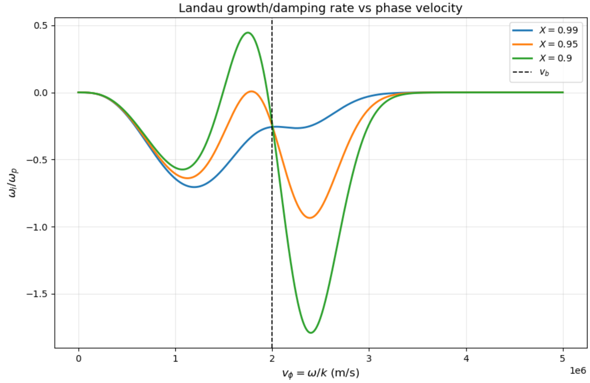
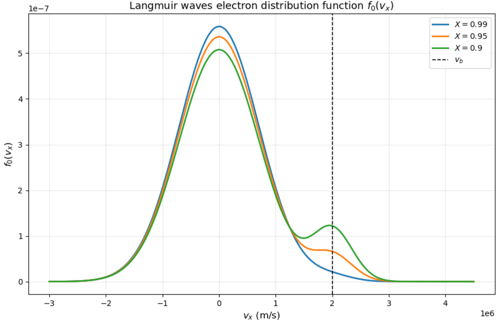

$\to$ [I. Laundau damping](#i)

$\to$ [II. Instability of ion acoustic wave](#ii)

## Summary of my solutions on this page


<div style="border: 1px solid #ccc; padding: 1rem; border-radius: 8px;">


Oh boy, kinetic description of plasmas. The math here is quite a bit more on the involved side. You'll have to blame Vlasov for thinking of a solution to the dispersion relation for his namesake kinetic equations. Yet, kinetics is a more accurate description of plasmas since the limitations of a cold plasma (no finite temperature effects) and fluid plasma (phase velocity >> thermal velocity) are removed. You'll also have to blame Landau for the coolest result of kinetic plasma physics - Landau damping - where from taking a Laplace transform of the kinetics dispersion relation, another term is yielded. A term that underlines collisionless wave damping. 

We will begin with using Landau's solution to derive a damping rate, but taking into consideration two populations of electrons. Spoiler - an electron beam population can result in a Landau instability when that beam dominates. We also derive the analytically true dispersion relation for our particular setup of Langmuir waves. Oh, and Langmuir waves are high frequency, electrostatic oscillations of electrons in a plasma relative to much heavior ions. That's why I'm saying electron a lot. 

We also consider another instability arising from an electron drift - but in an ion acoustic wave. We find the current density driving this wave unstable. Again, this crucially becomes unstable not because of collisions but because of incredible physics behavior from looking at plasma via a distribution function of velocities. Namely, kinetics. 
</div>


--------

# I
#### Consider Landau damping of Langmuir waves for a plasma in which there are two populations of electrons: Maxwellian and beam. The normalized distribution function in one dimension is given by:

$$
f_0(v_x) = \chi \left(\frac{1}{\pi v_{th,m}^2} \right)^{1/2} e^{-\left(\frac{v_x}{v_{th,m}}\ \right)^2} + (1-\chi) \left(\frac{1}{\pi v_{th,b}} \right)^{1/2} e^{-\left(\frac{v_x - v_b}{v_{th,b}} \right)^2}
$$

#### Where $\chi = n_m/n_0$ is the ratio of the Maxwellian population density, $n_m$, to the plasma density, $n_0 = n_m + n_b$. Here, $v_b$ is the beam velocity. $v_{th,m}$ and $v_{th,b}$ are the thermal velocities of the Maxwellian and beam electrons, respectively. We will split tasks to deal with this setup in 5 sections.

---------

1. ##### Find a general expression for $\omega_i / \omega_p$. 

The below dispersion relation includes CPDR, fluid description (Bohm-Gross), and kinetic description (last term) of plasma waves. It is essentially Landau's solution to the dispersion relation using Vlasov's kinetic equation for waves in a thermal, unmagnetized plasma. More crucially, it is the Landau solution for just a Maxwellian distribution function. We will begin with this simplified description. 

$$
D(k, \omega) = 1 - \frac{\omega_{pe}^2}{\omega^2} \left(1 + \frac{3 v_{th}^2}{v_{\phi}^2} \right) - \frac{ i \pi \omega_{pe}^2}{k^2} \frac{\partial f_0}{\partial v_x} \Bigg|_{v_x = \frac{\omega}{k}}=0
$$

With $\omega = \omega_r + i \omega_i$ we also have the real and imaginary components of the dispersion relation:

$$
D_r (k, \omega) = 1 - \frac{\omega_{pe}^2}{\omega^2} - \frac{3 \omega_{pe}^2 v_{th}^2}{\omega^2 v_{\phi}^2}, \quad D_i = -\pi \frac{\omega_{pe}^2}{k^2} \frac{\partial f_0}{\partial v_x} \Bigg|_{v_x = \frac{\omega}{k}}
$$

$$
D_r(k, \omega) = 1-\frac{\omega_{pe}^2}{\omega^2} - \frac{3 \omega_{pe}^2 v_{th}^2}{\omega^2 v_{\phi}^2} = 1 - \frac{\omega_{pe}^2}{\omega^2} - \frac{3 \omega_{pe}^2 k^2 v_{th}^2}{\omega^4}
$$

Landau damping is an inherently weak perturbation, so we will take $|\omega_i| \ll \omega_r$. Using the Taylor expansion relationship $f(x+\delta) \approx f(x) + \delta f^{\prime} (x)$:

$$
D(\omega_r + i \omega_i) \approx D(\omega_r) + (i \omega_i) \frac{\partial D}{\partial \omega} \Bigg|_{\omega_r} = 0
$$

$(i \omega_i) \frac{\partial D_i}{\partial \omega} \Bigg|_{\omega_r} = 0 $ and $D_r(\omega_r) =0$ so we expand as such:

$$
D(\omega_r + i \omega_i) \approx  i D_i(\omega_r)+ (i\omega_i) \frac{\partial D_r}{\partial \omega} \Bigg|_{\omega_r}  = 0
$$

$$
i D_i (\omega_r) + i \omega_i \frac{\partial D_r}{\partial \omega} \Bigg|_{\omega_r} = 0
$$

$$
\omega_i = \frac{-D_i (\omega_r)}{\frac{\partial D_r}{\partial \omega} \Big|_{\omega_r}}
$$

Ok cool note that. Let's calculate the derivative in the denominator:

$$
D_r = 1 - \omega_{pe}^2 \omega^{-2} - 3 \omega_{pe}^2 k^2 v_{th}^2 \omega^{-4}
$$

$$
\frac{\partial D_r}{\partial \omega} \Bigg|_{\omega_r} = 2 \omega_{pe}^2 \omega^{-3} +12 \omega_{pe}^2 k^2 v_{th}^2 \omega^{-5} \Bigg|_{\omega = \omega_r} = \frac{2\omega_{pe}^2}{\omega_r^3} + \frac{12\omega_{pe}^2 k^2 v_{th}^2}{\omega_r^5}
$$

Now we plug in $D_i$ and $\frac{\partial D_r}{\partial \omega}$ for $\omega_i$:

$$
\omega_i = -\frac{- \pi \frac{\omega_{pe}^2}{k^2} \frac{\partial f_0}{\partial v_x} \Big|_{v_x = \omega_r / k}}{\frac{2 \omega_{pe}^2}{\omega_r^3} + \frac{12 \omega_{pe}^2 k^2 v_{th}^2}{\omega_r^5}}
$$

Let's simplify this crazy mess. 

$$
\omega_i = \frac{\pi \frac{\omega_{pe}^2}{k^2} \frac{\partial f_0}{\partial v_x} \Big|_{v_x = \omega_r / k}}{\frac{2\omega_{pe}^2}{\omega_r^3}\left(1+ \frac{6k^2 v_{th}^2}{\omega_r^2} \right)}
$$

$$
\omega_i = \frac{\pi \omega_r^3}{2 k^2} \frac{\frac{\partial f_0}{\partial v_x} \Big|_{v_x = \omega_r/k}}{1+ \frac{6k^2v_{th}^2}{\omega_r^2}}
$$

Vlasov's solution is examined in the limit of $v_{\phi} \gg v_{th}$. And so (noting that $k^2 = \omega^2 / v_{\phi}^2$):

$$
\frac{ v_{th}^2}{v_{\phi}^2} \approx 0
$$


We also take that $\omega_r \approx \omega_p$ for this kinetic derivation:

$$
\omega_i = \frac{\pi \omega_{pe}^3}{2k^2} \frac{\frac{\partial f_0}{\partial v_x} \Big|_{v_x = \omega_{pe} / k}}{1} = \frac{\pi \omega_{pe}^3}{2k^2} \frac{\partial f_0}{\partial v_x} \Bigg|_{v_x = \omega_{pe} / k}
$$

Excellent. Let's now figure out the partial derivative of the distribution function $f_0$ for the two populations of electrons. Starting with the Maxwellian contribution:

$$
\frac{d}{d v_x} \left(\chi \frac{1}{\sqrt{\pi} v_{th,m}} e^{-v_x^2 / v_{th,m}^2} \right) = -\frac{2 \chi v_x}{\sqrt{\pi} v_{th,m}^3} e^{-v_x^2 / v_{th,m}^2}
$$

And then the beam contribution:

$$
\frac{d}{d v_x} \left((1-\chi) \frac{1}{\sqrt{\pi} v_{th,b}} e^{-(v_x - v_b)^2 / v_{th,b}^2} \right) = \frac{-2(1-\chi)(v_x - v_b)}{\sqrt{\pi} v_{th,b}^3} e^{-(v_x - v_b)^2 / v_{th,b}^2}
$$

Plugging these two into $\omega_i$ (and note that we're evaluating for $v_x = v_{\phi}$):

$$
\omega_i = - \sqrt{\pi} \frac{\omega_{pe}^3}{k^2} \left(\chi \frac{ v_{\phi}}{ v_{th,m}^3} e^{-v_{\phi}^2 / v_{th,m}^2}  + (1-\chi) \frac{v_{\phi} - v_b}{ v_{th,b}^3} e^{-(v_{\phi} - v_b)^2 / v_{th,b}^2} \right)
$$

Using $ \omega_{pe} \approx \omega_r$ and $v_{\phi} = \omega_r / k$:

$$
\frac{\omega_i}{\omega_{pe}} = -\sqrt{\pi} \left(\chi \frac{v_{\phi}^3}{v_{th,m}^3} e^{-v_{\phi}^2 / v_{th,m}^2} + (1 - \chi) \frac{v_{\phi}^2 (v_{\phi} - v_b)}{v_{th,b}^3} e^{-(v_{\phi} - v_b)^2 / v_{th,b}^2} \right)
$$

nice

2. ##### On one graph, plot $\omega_i / \omega_p$ versus $v_{\phi} = \omega /k$ for $v_{th,m} = 10^6$ m/s, $v_{th,b} = 5 \times 10^5$ m/s, and $v_b = 2 \times 10^6 $ m/s, for three values of $\chi = 0.99, 0.95, 0.90$. On a new graph, plot $f_0(v_x)$ for the above conditions. What do we see from these two graphs?

Not too complicated of a code is needed for the first graph:   

```python
import numpy as np
import matplotlib.pyplot as plt

# parameters
v_th_m = 1.0e6   
v_th_b = 5.0e5   
v_b = 2.0e6  

Xs = [0.99, 0.95, 0.90]

vphi_min = 0.0
vphi_max = 5.0e6
npts = 3000

v_phi = np.linspace(vphi_min, vphi_max, npts)

# function for omega_i / omega_p
def omega_i_over_omega_p(v_phi, X, v_th_m, v_th_b, v_b):
    term_maxwellian = X * (v_phi / v_th_m)**3 * np.exp(-(v_phi**2) / (v_th_m**2))
    term_beam = (1 - X) * (v_phi**2 * (v_phi - v_b) / v_th_b**3) * np.exp(-((v_phi - v_b)**2) / (v_th_b**2))
    return -np.sqrt(np.pi) * (term_maxwellian + term_beam)

# plot
plt.figure(figsize=(9, 6))

for X in Xs:
    y = omega_i_over_omega_p(v_phi, X, v_th_m, v_th_b, v_b)
    plt.plot(v_phi, y, linewidth=2, label=fr'$X = {X}$')

plt.axvline(v_b, linestyle='--', linewidth=1.2, color='k', label=r'$v_b$')
plt.xlabel(r'$v_{\phi} = \omega/k \ \mathrm{(m/s)}$', fontsize=12)
plt.ylabel(r'$\omega_i/\omega_p$', fontsize=12)
plt.title(r'Landau growth/damping rate vs phase velocity', fontsize=13)
plt.legend()
plt.grid(True, alpha=0.3)
plt.ticklabel_format(style='sci', axis='x', scilimits=(0, 0))
plt.tight_layout()
plt.show()
```



Code for the second graph:

```python
vx_min = -3.0e6
vx_max = 4.5e6
npts = 3000

v_x = np.linspace(vx_min, vx_max, npts)

# Langmuir distribution function
def f0(v_x, X, v_th_m, v_th_b, v_b):
    maxwellian = X * (1 / (np.pi * v_th_m**2))**0.5 * np.exp(-(v_x / v_th_m)**2)
    beam = (1 - X) * (1 / (np.pi * v_th_b**2))**0.5 * np.exp(-((v_x - v_b) / v_th_b)**2)
    return maxwellian + beam

# def
plt.figure(figsize=(9, 6))

for X in Xs:
    y = f0(v_x, X, v_th_m, v_th_b, v_b)
    plt.plot(v_x, y, linewidth=2, label=fr'$X = {X}$')

plt.axvline(v_b, linestyle='--', linewidth=1.2, color='k', label=r'$v_b$')
plt.xlabel(r'$v_x \ \mathrm{(m/s)}$', fontsize=12)
plt.ylabel(r'$f_0(v_x)$', fontsize=12)
plt.title(r'Langmuir waves electron distribution function $f_0(v_x)$', fontsize=13)
plt.legend()
plt.grid(True, alpha=0.3)
plt.ticklabel_format(style='sci', axis='x', scilimits=(0, 0))
plt.tight_layout()
plt.show()
```



Here's what I notice that makes physical and mathematical sense from these graphs:

- The sign of $\omega_i$ is controlled by the slope $\frac{\partial f_0}{\partial v} \Big|_{v_{\phi}}$.

- The Maxwellian background gives ordinary Landau damping because its slope is negative for $v>0$. 

- However, the beam creates a bump near $v_b$, giving positive slope for $v_{\phi} < v_b$ and negative slope for $v_{\phi} > v_b$ on $f_0(v_x)$ (for smaller $\chi$s).

- Therefore, for lower $\chi$s at least, waves with phase velocity just below the beam speed grow unstable, while waves just above the beam speed are damped. 

- Lastly, lower $\chi$ means a stronger beam, which increases both the instability on the left side of the beam velocity and the damping on the right side. 

3. ##### Consider the case above with $\chi = 0.90$. For $n_0 = 10^{18}$ $\text{m}^{-3}$, calculate the ratio $\omega_{i,max} / \nu_e$, where $\omega_{i,max}$ is the maximum growth rate and $\nu_e$ is the electron thermal equilibriation rate (can be found in the NRL Plasma Formulary). Repeat for $10^{21}$ $\text{m}^{-3}$. Comment on your results. 

The following code makes these calculations in a clean manner:

```python
X = 0.90

# physical constants
m_e = 9.1094e-31     
e = 1.6022e-19      
eps0 = 8.8542e-12  

# numerically find max growth
y = omega_i_over_omega_p(v_phi, X, v_th_m, v_th_b, v_b)

imax = np.argmax(y)
vphi_max = v_phi[imax]
omega_i_over_omega_p_max = y[imax]

print(f"v_phi,max = {vphi_max:.6e} m/s")
print(f"(omega_i/omega_p)_max = {omega_i_over_omega_p_max:.10f}")

# convert v_th,m to T_e in eV
# using f ~ exp[-(v/v_th)^2], so v_th = sqrt(2 kT / m)
# => T_e[eV] = m_e v_th^2 / (2 e)
T_e_eV = m_e * v_th_m**2 / (2 * e)
print(f"T_e = {T_e_eV:.6f} eV")

# NRL Coulomb log for thermal e-e collisions
# n in cm^-3, T in eV
def lnLambda_ee(ne_cm3, Te_eV):
    return 23.5 - np.log(ne_cm3**0.5 * Te_eV**(-1.25)) - np.sqrt(1e-5 + (np.log(Te_eV) - 2.0)**2 / 16.0)

# NRL electron collision rate
# nu_e = 2.91e-6 * n_e * lnLambda * T_e^(-3/2) [s^-1]
# n_e in cm^-3, T_e in eV
def nu_e(ne_cm3, Te_eV):
    ll = lnLambda_ee(ne_cm3, Te_eV)
    return 2.91e-6 * ne_cm3 * ll * Te_eV**(-1.5), ll

# plasma frequency 
def omega_p(ne_m3):
    return np.sqrt(ne_m3 * e**2 / (eps0 * m_e))

# evaluate for the two n_0 densities
densities_m3 = [1e18, 1e21]

for n0_m3 in densities_m3:
    ne_cm3 = n0_m3 / 1e6
    wp = omega_p(n0_m3)
    wi_max = omega_i_over_omega_p_max * wp
    nue, lnL = nu_e(ne_cm3, T_e_eV)
    ratio = wi_max / nue

    print("\n-----------------------------------")
    print(f"n0 = {n0_m3:.3e} m^-3")
    print(f"n_e = {ne_cm3:.3e} cm^-3")
    print(f"ln Lambda_ee = {lnL:.6f}")
    print(f"omega_p = {wp:.6e} s^-1")
    print(f"omega_i,max = {wi_max:.6e} s^-1")
    print(f"nu_e = {nue:.6e} s^-1")
    print(f"omega_i,max / nu_e = {ratio:.6e}")
```

Output:

```
v_phi,max = 1.748916e+06 m/s
(omega_i/omega_p)_max = 0.4456305447
T_e = 2.842779 eV

-----------------------------------
n0 = 1.000e+18 m^-3
n_e = 1.000e+12 cm^-3
ln Lambda_ee = 10.751641
omega_p = 5.641534e+10 s^-1
omega_i,max = 2.514040e+10 s^-1
nu_e = 6.527595e+06 s^-1
omega_i,max / nu_e = 3.851403e+03

-----------------------------------
n0 = 1.000e+21 m^-3
n_e = 1.000e+15 cm^-3
ln Lambda_ee = 7.297764
omega_p = 1.784010e+12 s^-1
omega_i,max = 7.950092e+11 s^-1
nu_e = 4.430658e+09 s^-1
omega_i,max / nu_e = 1.794337e+02
```

So for the smaller density:

$$
\frac{\omega_{i,max}}{\nu_e} \approx 3.85 \times 10^3
$$

And for the larger density:

$$
\frac{\omega_{i,max}}{\nu_e} \approx 1.79 \times 10^2
$$

In both cases, the instability growth rate is larger than the equilibriation rate, so the wave evolution is much faster than thermal equilibriation. This implies less collisions. Also, as $n_0$ increases, the maximum growth rate $\omega_{i,max}$ increases because it scales with the plasma frequency, $\omega_p \propto \sqrt{n_0}$. However, the electron thermal equilibriation rate $\nu_e$ increases even faster with density, roughly directly proportional. So the ratio $\omega_{i,max}/\nu_0$ decreases with increasing density. 

4. ##### Let's return to part 1 where we already assumed a dispersion relation to use for our particular distribution function. Well, rederive the dispersion relation for $f_0(v_x)$. Is the Bohm-Gross Dispersion Relation (BGDR) modified by the beam? How about the equation for $\omega_i$?

Below is the general dispersion relation that includes Vlasov's solution and collisionless wave damping called Landau damping which is what we've been talking about all this time of course.

$$
D(\omega, k) = 1 +\frac{n_0 e^2}{\varepsilon_0 m k} \left(\operatorname{Pr} \int_{-\infty}^{\infty} \frac{\partial f_0 / \partial v_x}{\omega - k v_x} d v_x - \frac{i\pi}{k} \frac{\partial f_0}{\partial v_x} \Bigg|_{v_x=\omega/k} \right)
$$

$$
= 1 + \frac{\omega_p^2}{k} \left(\operatorname{Pr} \int_{-\infty}^{\infty} \frac{\partial f_0 / \partial v_x}{\omega - k v_x} d v_x - \frac{i\pi}{k} \frac{\partial f_0}{\partial v_x} \Bigg|_{v_x=\omega/k} \right)
$$

Integral by parts:

$$
\int_{-\infty}^{\infty} \frac{\partial f_0}{\partial v_x} \frac{d v_x}{\omega - k v_x} = \frac{1}{k} \int_{-\infty}^{\infty} \frac{\partial f_0}{\partial v_x} \frac{d v_x}{\frac{\omega}{k} -v_x} = -\frac{1}{k} \int_{-\infty}^{\infty} \frac{\partial f_0}{\partial v_x} \frac{d v_x}{v_x - v_{\phi}} = -\frac{1}{k} \left (\frac{f_0}{v_x - v_{\phi}} \Bigg|_{-\infty}^{\infty} \right) + \frac{1}{k} \int_{-\infty}^{\infty} \frac{-f_0}{(v_x - v_{\phi})^2} dv_x
$$

$$
= - \frac{1}{k} \int_{-\infty}^{\infty} \frac{f_0}{(v_x - v_{\phi})^2} dv_x
$$

If $v_x \gg v_{\phi}$, we expand $(v_x - v_{\phi})^{-2}$:

$$
(v_x - v_{\phi})^{-2} = v_{\phi}^{-2} \left(1 - \frac{v_x}{v_{\phi}} \right)^{-2}
$$

$$
= v_{\phi}^{-2} \left(1 + \frac{2v_x}{v_{\phi}} + \frac{3 v_x^2}{v_{\phi}^2} + \frac{4 v_x^3}{v_{\phi}^3} + ... \right)
$$

We do not have a symmetric distribution function for$v_x$ so we will keep the odd term $\frac{2 v_x}{v_{\phi}}$ although we can drop the higher order term $\frac{4v_x^3}{v_{\phi}^3}$:

$$
\int_{-\infty}^{\infty} \frac{\partial f_0}{\partial v_x} \frac{d v_x}{\omega - k v_x} = -\frac{1}{k} \int_{-\infty}^{\infty} \frac{f_0}{v_{\phi}^2} \left(1 + \frac{2v_x}{v_{\phi}} + \frac{3v_x^2}{v_{\phi}^2} \right) dv_x
$$

$$
= -\frac{1}{k} \left(\int_{-\infty}^{\infty} \frac{f_0}{v_{\phi}^2} dv_x + \int_{-\infty}^{\infty} \frac{f_0}{v_{\phi}^2} \left(\frac{2v_x}{v_{\phi}}\right) dv_x + \int_{-\infty}^{\infty} \frac{f_0}{v_{\phi}^2} \left(\frac{3v_x^2}{v_{\phi}^2} \right) dv_x \right)
$$

Before integrating each piece, consider the below Gaussian integrals to help us:

$$
\int_{-\infty}^{\infty} e^{-u^2} du = \sqrt{\pi}
$$

$$
\int_{-\infty}^{\infty} u e^{-u^2} du = 0
$$

$$
\int_{-\infty}^{\infty} u^2 e^{-u^2} du = \frac{\sqrt{\pi}}{2}
$$

Let's start with the first integral:

$$
\int_{-\infty}^{\infty} f_0 dv_x = \chi \left(\frac{1}{\pi v_{th,m}^2} \right)^{1/2} \int_{-\infty}^{\infty} e^{-(v_x/v_{th,m})^2} dv_x + (1-\chi) \left(\frac{1}{\pi v_{th,b}^2} \right)^{1/2} \int_{-\infty}^{\infty} e^{((v_x - v_b)/v_{th,b})^2} dv_x
$$

Substitutions: $u = \frac{v_x}{v_{th,m}} \to du = \frac{1}{v_{th,m}} dv_x$ and $v = \frac{v_x - v_b}{v_{th,b}} \to dv = \frac{1}{v_{th,b}} dv_x$.

$$
\int_{-\infty}^{\infty} f_0 dv_x = \chi \left(\frac{1}{\pi v_{th,m}^2} \right)^{1/2} \int_{-\infty}^{\infty} v_{th,m} e^{-u^2} du + (1-\chi) \left(\frac{1}{\pi v_{th,b}^2} \right)^{1/2} \int_{-\infty}^{\infty} v_{th,b} e^{-v^2} dv
$$

$$
= \chi \frac{1}{\sqrt{\pi} v_{th,m}} v_{th,m} \sqrt{\pi} + (1-\chi) \frac{1}{\sqrt{\pi} v_{th,b}} v_{th,b} \sqrt{\pi} = 1
$$

The second integral using the same substitutions:

$$
\int_{-\infty}^{\infty} f_0 v_x dv_x = \chi \frac{1}{\sqrt{\pi} v_{th,m}} \int_{-\infty}^{\infty} v_x e^{-(v_x/v_{th,m})^2} dv_x +(1-\chi) \frac{1}{\sqrt{\pi} v_{th,b}} \int_{-\infty}^{\infty} v_x e^{-((v_x-v_b)/ v_{th,b})^2} dv_x
$$

$$
= \chi \frac{1}{\sqrt{\pi} v_{th,m}} \int_{-\infty}^{\infty} v_{th,m}^2 u e^{-u^2} du + (1-\chi) \frac{1}{\sqrt{\pi} v_{th,b}} \int_{-\infty}^{\infty} (v v_{th,b} + v_b) e^{-v^2} v_{th,b} dv
$$

$$
= 0 + (1-\chi) \frac{1}{\sqrt{\pi} v_{th,b}} \left(\int_{-\infty}^{\infty} v v_{th,b}^2 e^{-v^2} dv + \int_{-\infty}^{\infty} v_b v_{th,b} e^{-v^2} dv \right)
$$

$$
= (1-\chi) \frac{1}{\sqrt{\pi}} v_b \sqrt{\pi} = (1-\chi) v_b
$$

Using the same substitutions a third time for the third integral (with $v_x^2 = u^2 v_{th,m}^2$ and $v_x^2=(v v_{th,b} + v_b)^2$):

$$
\int_{-\infty}^{\infty} f_0 v_x^2 dv_x = \chi \frac{1}{\sqrt{\pi} v_{th,m}} \int_{-\infty}^{\infty} v_x^2 e^{-(v_x / v_{th,m})^2} dv_x + (1-\chi) \frac{1}{\sqrt{\pi} v_{th,b}} \int_{-\infty}^{\infty} v_x^2 e^{-((v_x - v_b)/v_{th,b})^2} dv_x
$$

$$
= \chi \frac{1}{\sqrt{\pi} v_{th,m}} \int_{-\infty}^{\infty} u^2 v_{th,m}^3 e^{-u^2} du + (1-\chi) \frac{1}{\sqrt{\pi} v_{th,b}} \int_{-\infty}^{\infty} (v_{th,b} v + v_b)^2 e^{-v^2} dv v_{th,b}
$$

$$
= \chi \frac{1}{\sqrt{\pi}} v_{th,m}^2 \frac{\sqrt{\pi}}{2} + (1-\chi) \frac{1}{\sqrt{\pi}} \int_{-\infty}^{\infty} (v_{th,b}^2 v^2 + 2v_{th,b} v_b v + v_b^2) e^{-v^2} dv
$$

$$
=\frac{\chi}{2} v_{th,m}^2 + (1-\chi) \frac{1}{\sqrt \pi} \left(\int_{-\infty}^{\infty} v_{th,b}^2 v^2 e^{-v^2} dv + \int_{-\infty}^{\infty} 2v_{th,b} v_b v e^{-v^2} dv + \int_{-\infty}^{\infty} v_b^2 e^{-v^2} dv \right)
$$

$$
=\frac{\chi}{2} v_{th,m}^2 + (1-\chi )\frac{1}{\sqrt{\pi}} \left(v_{th,b}^2 \frac{\sqrt{\pi}}{2} + 0 + v_b^2 \sqrt{\pi} \right)
$$

$$
= \frac{\chi}{2} v_{th,m}^2 + (1-\chi) \left(\frac{v_{th,b}^2}{2} + v_b^2 \right)
$$

Now we can return to solving the integral in $D(k, \omega)$ using the above Gaussian integrals:

$$
\int_{-\infty}^{\infty} \frac{\partial f_0}{\partial v_x} \frac{dv_x}{\omega - k v_x} = -\frac{1}{k} \left( \int_{-\infty}^{\infty} \frac{f_0}{v_{\phi}^2} dv_x + \int_{-\infty}^{\infty} \frac{f_0}{v_{\phi}^2} \left( \frac{2 v_x}{v_{\phi}} \right) dv_x + \int_{-\infty}^{\infty} \frac{f_0}{v_{\phi}^2} \left(\frac{3v_x^2}{v_{\phi}^2} \right ) dv_x \right)
$$

$$
= -\frac{1}{k} \left (\frac{1}{v_{\phi}^2} + \frac{2(1-\chi) v_b}{v_{\phi}^2 v_{\phi}} + \frac{3 \left(\frac{\chi}{2} v_{th,m}^2 + (1-\chi)\left(\frac{v_{th,b}^2}{2} + v_b^2 \right) \right)}{v_{\phi}^2v_{\phi}^2} \right)
$$

$$
= -\frac{1}{k} \left(\frac{1}{\left(\frac{\omega}{k} \right)^2} + \frac{2(1-\chi) v_b}{\left(\frac{\omega}{k} \right)^2 v_{\phi}} + \frac{3 \left(\frac{\chi}{2} v_{th,m}^2 + (1-\chi) \left(\frac{v_{th,b}^2}{2} +v_b^2 \right) \right)}{\left(\frac{\omega}{k} \right)^2 v_{\phi}^2} \right)
$$

$$
= -\frac{k}{\omega^2} \left(1 + \frac{2(1-\chi)v_b}{v_{\phi}} + \frac{3 \left(\frac{\chi}{2} v_{th,m}^2 + (1-\chi) \left(\frac{v_{th,b}^2}{2} +v_b^2 \right) \right)}{v_{\phi}^2} \right)
$$

$$
\frac{\omega_p^2}{k} \left(\operatorname{Pr} \int_{-\infty}^{\infty} \frac{\partial f_0 / \partial v_x}{\omega - kv_x} dv_x \right)= -\frac{\omega_p^2}{\omega^2} \left(1 + \frac{2(1-\chi)v_b}{v_{\phi}} + \frac{3 \left(\frac{\chi}{2} v_{th,m}^2 + (1-\chi) \left(\frac{v_{th,b}^2}{2} +v_b^2 \right) \right)}{v_{\phi}^2} \right)
$$

And now the derived dispersion relation for our distribution function:

$$
D(\omega, k) = 1 -\frac{\omega_p^2}{\omega^2} \left(1 + \frac{2(1-\chi)v_b}{v_{\phi}} + \frac{3 \left(\frac{\chi}{2} v_{th,m}^2 + (1-\chi) \left(\frac{v_{th,b}^2}{2} +v_b^2 \right) \right)}{v_{\phi}^2} \right) - \frac{i\pi \omega_p^2}{k^2} \frac{\partial f_0}{\partial v_x} \Bigg|_{v_x = \omega/k} 
$$

Our fluid BGDR is different now, indicating that a beam distribution function does modify it. 

Now let's look at the growth/damping rate $\omega_i$. From part 1:

$$
\omega_i = -\frac{D_i(\omega_r)}{\frac{\partial D_r}{\partial \omega} \Big|_{\omega_r}}
$$

$$
D_r(\omega,k) = 1-\frac{\omega_p^2}{\omega^2} - \frac{2(1-\chi)v_b \omega_p^2 k}{\omega^3} - \frac{3 \left(\frac{\chi}{2} v_{th,m}^2 + (1-\chi) \left(\frac{v_{th,b}^2}{2} + v_b^2 \right) \right) \omega_p^2 k^2}{\omega^4}
$$

$$
\frac{\partial D_r}{\partial \omega} \Bigg|_{\omega_r} = \frac{2\omega_p^2}{\omega_r^3}+ \frac{6(1-\chi) v_b \omega_p^2 k}{\omega_r^4} + \frac{12 \left(\frac{\chi}{2} v_{th,m}^2 + (1-\chi) \left(\frac{v_{th,b}^2}{2} + v_b^2 \right) \right) \omega_p^2 k^2}{\omega_r^5}
$$

$$
\omega_i = \frac{\frac{\pi \omega_p^2}{k^2} \frac{\partial f_0}{\partial v_x} \Big|_{v_x = \omega/k}}{\frac{2 \omega_p^2}{\omega_r^3} \left(1+ \frac{3(1-\chi) v_b k}{\omega_r} + \frac{6 \left(\frac{\chi}{2} v_{th,m}^2 + (1-\chi) \left(\frac{v_{th,b}^2}{2} + v_b^2 \right) \right) k^2}{\omega_r^2} \right)}
$$

$$
\omega_i = \frac{\pi \omega_r^3}{2 k^2} \frac{\frac{\partial f_0}{\partial v_x} \Big|_{v_x = \omega/k}}{ 1+ \frac{3(1-\chi) v_b k}{\omega_r} + \frac{6 \left(\frac{\chi}{2} v_{th,m}^2 + (1-\chi) \left(\frac{v_{th,b}^2}{2} + v_b^2 \right) \right) k^2}{\omega_r^2}}
$$

$$
\omega_i = \frac{\pi \omega_r^3}{2 k^2} \frac{\frac{\partial f_0}{\partial v_x} \Big|_{v_x = \omega/k}}{ 1+ \frac{3 (1-\chi) v_b}{v_{\phi}} + \frac{3\chi v_{th,m}^2}{v_{\phi}^2} + (1-\chi)\left(\frac{3 v_{th,b}^2}{v_{\phi}^2} + \frac{6v_b^2}{v_{\phi}^2} \right)}
$$

Assuming $v_{\phi} \gg v_{th,m}$, $v_{\phi} \gg v_{th,b}$, and $\omega_r \approx \omega_p$:

$$
\omega_i = \frac{\pi \omega_p^3}{2k^2} \frac{\frac{\partial f_0}{\partial v_x}\Big|_{v_x=\omega/k}}{1+\frac{3(1-\chi)v_b}{v_{\phi}} + \frac{6 (1-\chi) v_b^2}{v_{\phi}^2}}
$$

From part 1:

$$
\frac{\partial f_0}{\partial v_x} \Bigg|_{v_x=v_{\phi}} = -\frac{2 \chi v_{\phi}}{\sqrt{\pi} v_{th,m}^3} e^{-v_{\phi}^2 / v_{th,m}^2} - \frac{2 (1-\chi) (v_{\phi} - v_b)}{\sqrt{\pi} v_{th,b}^3} e^{-(v_{\phi} - v_b)^2 / v_{th,b}^2}
$$

And we get an equation for Landau damping that is also modified by the beam:

$$
\omega_i = -\sqrt{\pi} \frac{\omega_p^3}{k^2} \left(\frac{\frac{ \chi v_{\phi}}{ v_{th,m}^3} e^{-v_{\phi}^2 / v_{th,m}^2} + \frac{ (1-\chi) (v_{\phi} - v_b)}{ v_{th,b}^3} e^{-(v_{\phi} - v_b)^2 / v_{th,b}^2}}{1+\frac{3(1-\chi)v_b}{v_{\phi}} + \frac{6 (1-\chi) v_b^2}{v_{\phi}^2}} \right)
$$
nice


--------

# II
#### Estimate the current density (in $\text{A}/\text{m}^2$) required to drive the ion acoustic wave unstable for $T_e/T_i =10$ and $T_e/T_i=20$.
---------

The Landau damping rate for acoustic waves is as follows (where $c_s$ is the sound speed):

$$
\gamma_{L_i} = \frac{1}{2} \sqrt{\frac{\pi}{2}} k c_s \left(\sqrt{\frac{m_e}{m_i}} + \left(\frac{T_e}{T_i} \right)^{3/2} e^{-T_e / 2T_i} \right)
$$

Where $c_s = \frac{k T_e}{m_i}$ for $T_e \gg T_i$. And note that $\omega_r = k c_s$. 

So, the Landau damping of ion acoustic waves can actually be rendered unstable if one adds drift to the electrons (hence driving current). This is in effect what is called inverse Landau damping. As such, the above Landau damping growth rate is without that drift that would cause instability.

Here is the Maxwellian with electron drift:

$$
f_{0_e} (v_x) = \frac{1}{\sqrt{2\pi} v_{th, e}} e^{-(v_x - v_e)^2 / 2v_{th,e}^2}
$$

$$
\frac{\partial f_{0_e}}{\partial v_x} = \frac{1}{\sqrt{2\pi} v_{th,e}} \left(\frac{-2(v_x-v_e)}{2v_{th,e}^2} \right) e^{-(v_x - v_e)^2 / 2v_{th,e}^2} = -\frac{v_x - v_e}{\sqrt{2\pi} v_{th,e}^3} e^{-(v_x - v_e)^2 / 2v_{th,e}^2}
$$

$$
\frac{\partial f_{0_e}}{\partial v_x} \Bigg|_{v_x = \omega/k} = -\frac{\frac{\omega}{k} - v_e}{\sqrt{2\pi} v_{th,e}^3}  e^{-(\omega / k - v_e)^2 / 2v_{th,e}^2}
$$

And now the Landau damping term:

$$
-i \pi \frac{\omega_{pe}^2}{k^2} \frac{\partial f_{0_e}}{\partial v_x} \Bigg|_{v_x = \omega/k} = i \sqrt{\frac{\pi}{2}} \frac{\omega_{pe}^2 (\omega - kv_e)}{k^3 v_{th,e}^3} e^{-(\omega / k - v_e)^2 / 2v_{th,e}^2}
$$

Since $\omega/k \ll v_{th,e}$ the exponent goes to 0 and the exponential is just 1. 

$$
-i \pi \frac{\omega_{pe}^2}{k^2} \frac{\partial f_{0_e}}{\partial v_x} \Bigg|_{v_x = \omega/k} \approx i \sqrt{\frac{\pi}{2}} \frac{\omega_{pe}^2 (\omega - kv_e)}{k^3 v_{th,e}^3}
$$

Compare the above with the Landau damping term without drift Maxwellian electrons:

$$
i \sqrt{\frac{\pi}{2}} \frac{\omega_{pe}^2 \omega}{k^3 v_{th,e}^3}
$$

We can note that $\omega$ is replaced by $\omega - k v_e$ when introducing those drifting Maxwellian electrons. So we impose the following fraction:

$$
\frac{\omega - kv_e}{\omega} = 1 - \frac{k v_e}{\omega}
$$

For an ion acoustic wave, $\omega_r = kc_s$. As such we have our drift factor for our electron term:

$$
\frac{\omega - kv_e}{\omega} = 1 - \frac{v_e}{c_s}
$$

Let's take a look again at the Landau damping rate for acoustic waves. The electron term is on the left and ion term on the right.

$$
\gamma_{L_i} = \frac{1}{2} \sqrt{\frac{\pi}{2}} k c_s \left(\sqrt{\frac{m_e}{m_i}} + \left(\frac{T_e}{T_i} \right)^{3/2} e^{-T_e / 2T_i} \right)
$$

With some mathematical magic we multiply the electron term here with the drift factor we've derived. 

$$
\gamma_{L_i, \text{drift}} = \frac{1}{2} \sqrt{\frac{\pi}{2}} k c_s \left(\sqrt{\frac{m_e}{m_i}} \left(1 - \frac{v_e}{c_s} \right) + \left(\frac{T_e}{T_i} \right)^{3/2} e^{-T_e / 2T_i} \right)
$$

The wave becomes unstable when the damping changes sign at threshold $\gamma = 0$:

$$
\gamma_{L_i, \text{drift}} = 0 = \sqrt{\frac{m_e}{m_i}} \left(1 - \frac{v_e}{c_s} \right) + \left(\frac{T_e}{T_i} \right)^{3/2} e^{-T_e / 2T_i}
$$

$$
\frac{v_e}{c_s} = 1 + \sqrt{\frac{m_i}{m_e}} \left(\frac{T_e}{T_i} \right)^{3/2} e^{-T_e / 2T_i}
$$

$$
J = e n_0 v_e = e n_0 c_s \left(1 + \sqrt{\frac{m_i}{m_e}} \left(\frac{T_e}{T_i} \right)^{3/2} e^{-T_e / 2T_i} \right)
$$

$$
\frac{m_i}{m_e} = 1836
$$

$$
J = e n_0 c_s (1 + \sqrt{1836} (10)^{3/2} e^{-5}) 
\quad \text{or} \quad = e n_0 c_s (1 + \sqrt{1836} (20)^{3/2} e^{-10}) 
$$

$$
c_s = \sqrt{\frac{k_b T_e}{m_i}}
$$

Using $T_i = 300 \text{ K}$, $n_0 = 10^{15} \text{ m}^{-3}$ (from Swanson p. 159):

$$
J = (1.602 \times 10^{-19}) (10^{15}) \sqrt{\frac{1.381 \times 10^{-23} \times 3000}{1.67 \times 10^{-27}}} (1 + \sqrt{1836} (10^{3/2}) e^{-5}) \quad \text{or} \quad = (1.602 \times 10^{-19}) (10^{15}) \sqrt{\frac{1.381 \times 10^{-23} \times 6000}{1.67 \times 10^{-27}}} (1 + \sqrt{1836} (20^{3/2}) e^{-10})
$$

For $\frac{T_e}{T_i} = 10$:

$$
J \approx 8.08 \frac{\text{A}}{\text{m}^2}
$$

For $\frac{T_e}{T_i} = 20$:

$$
J \approx 1.32 \frac{\text{A}}{\text{m}^2}
$$

nice